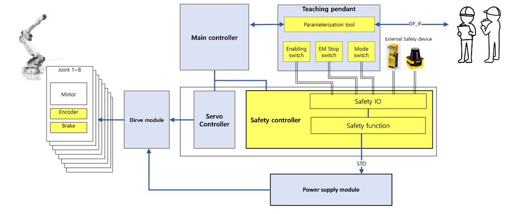

# 1.1.2 Safety Performance

The safety performance of SafeSpace2.0's emergency stop and external device interface (basic safety input/output, PROFIsafe) is as follows:
|            **Item**            | **Safety Performance** |         **Applicable Standard**         |
| :--------------------------: | :-------: | :-----------------------: |
|              HFT             |     1     | IEC 61508/62061/61800-5-2 |
| SIL (Safety Integrity Level) |     3     | IEC 61508/62061/61800-5-2 |
|           Category           |     4     |        ISO 13849-1        |
|    PL (Performance Level)    |     e     |        ISO 13849-1        |
|    		PFH    			   |  1.5E-08  |         IEC 61508         |

The safety performance of other safety functions is as follows:
|            **Item**            | **Safety Performance** |         **Applicable Standard**         |
| :--------------------------: | :-------: | :-----------------------: |
|              HFT             |     1     | IEC 61508/62061/61800-5-2 |
| SIL (Safety Integrity Level) |     2     | IEC 61508/62061/61800-5-2 |
|           Category           |     3     |        ISO 13849-1        |
|    PL (Performance Level)    |     d     |        ISO 13849-1        |
|    		PFH    			   |  1.5E-07  |         IEC 61508         |

