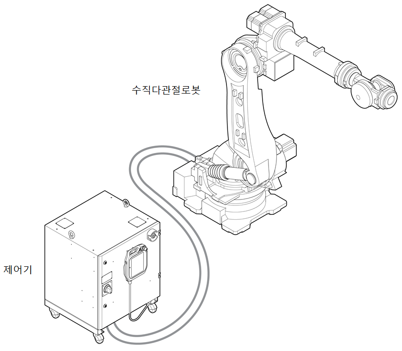

# 2.1 로봇 시스템

산업용 로봇이란 “자동 제어에 의한 조작\(manipulation\) 기능 및 이동 동작 기능이 탑재되어 산업 현장에서 다양한 작업을 프로그램으로 실행할 수 있는 기계”입니다. 협동로봇은 산업용 로봇의 한 종류입니다.

로봇 시스템은 로봇 본체와 본체를 제어하는 제어기로 구성됩니다. 제어기에는 로봇 시스템의 설정 및 수동 조작에 사용하는 티치 펜던트가 부착됩니다.

* 로봇: 물체를 운반하거나 부품을 조립하는 등 산업 현장에서 다양한 작업을 수행합니다.
* 제어기: 티치 펜던트로 설정한 프로그램의 설정값에 따라 로봇의 동작을 조정합니다. 제어기의 입출력 포트를 이용해 다양한 외부 장비 또는 장치와 연동할 수 있습니다.
* 티치 펜던트: 로봇 시스템 전체를 관리하는 장치입니다. 로봇에게 특정 자세를 학습시키거나 프로그램을 설정 및 제어할 수 있습니다.

로봇 유형에 따른 로봇 시스템의 기본 구성의 예는 다음과 같습니다.


로봇 시스템에 대한 자세한 내용은 “[**Hi6 제어기 조작 설명서**](https://hrbook-hrc.web.app/#/view/doc-hi6-operation/korean-tp630/1-robot-system/README)”을 참고하십시오.


