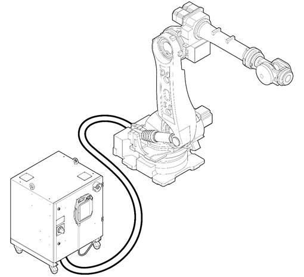

# 2.1 Robot system

Industrial robots are “machines that are equipped with manipulation and movement functions based on automatic control for them to perform various works by using programs at an industrial site.” The collaborative robot is a type of industrial robot.

The robot system consists of a manipulator and a controller that controls the manipulator. A teach pendant that is to be used for setting and manually operating the robot system is attached to the controller.

* Robot: Performs various works in industrial sites such as transporting objects, assembling parts, etc.
* Controller: Adjusts the robot’s operation according to the program setting values set through the teach pendant. It can be interoperated with various external equipment or devices through the input/output port of the controller. 
* Teach Pendant: A device that manages the entire robot system. It enables you to teach the robot a specific posture or setup and control the programs.

The following shows an example of the basic configuration of the robot system.


For more details on teach pendant, see “[Operation Manual for Hi6 Controllers.](https://hyundai-robotics.gitbook.io/hi6-operation-manual/v/op-english/)”

