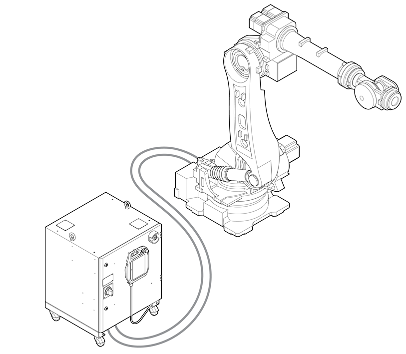

# 2.1 机器人系统

工业机器人是一种配备自动控制、操纵和运动功能的机器，能够在工业环境中执行各种编程任务。协作机器人是一种工业机器人。

机器人系统由一个机器人主体和一个控制器组成，控制器控制机器人主体。教导 Pendant 连接到控制器，使机器人系统的设置和手动操作成为可能。

* 机器人：在工业环境中执行各种任务，如运输物体或组装零件。
* 控制器：根据通过教导 Pendant 设置的程序设置来协调机器人的运动。控制器的输入/输出端口可用于与各种外部设备或装置进行接口。
* 教导 Pendant：该设备管理整个机器人系统。它可用于教导机器人特定姿势或设置和控制程序。

根据机器人类型，基本机器人系统配置的示例如下：


有关机器人系统的更多信息，请参阅 "[Hi7 Controller Operating Instructions](https://hrbook-hrc.web.app/#/view/doc-hi6-operation/zh-tp630/1-robot-system/README?cont_model=Hi7)"。
