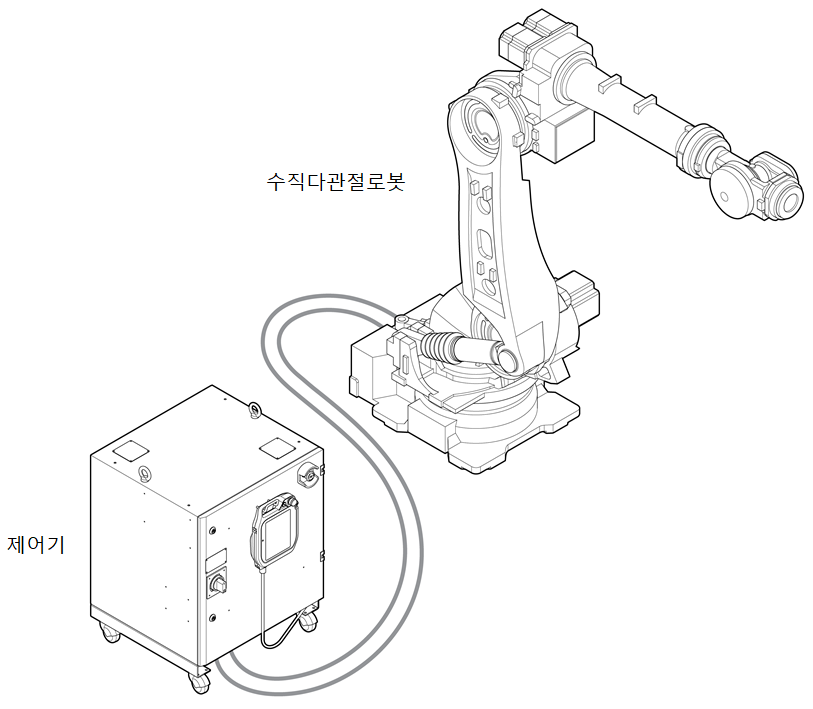

# 2.1 机器人系统

工业机器人是一种配备自动控制、操作和运动功能的机器，能够在工业环境中执行预先编程的各种任务。协作机器人是工业机器人的一种。

机器人系统由机器人本体和控制该本体的控制器组成。示教器连接到控制器上，用于设置和手动操作机器人系统。

* 机器人：在工业环境中执行各种任务，例如搬运物体或组装零件。

* 控制器：根据示教器设置的程序协调机器人的运动。控制器的输入/输出端口可用于连接各种外部设备。

* 示教器：该设备管理整个机器人系统。它可用于向机器人示教特定姿态，或设置和控制程序。

根据机器人类型，机器人系统的基本配置示例如下：


有关机器人系统的更多信息，请参阅“[**Hi6 控制器操作说明**](https://hrbook-hrc.web.app/#/view/doc-hi6-operation/korean-tp630/1-robot-system/README)”。


