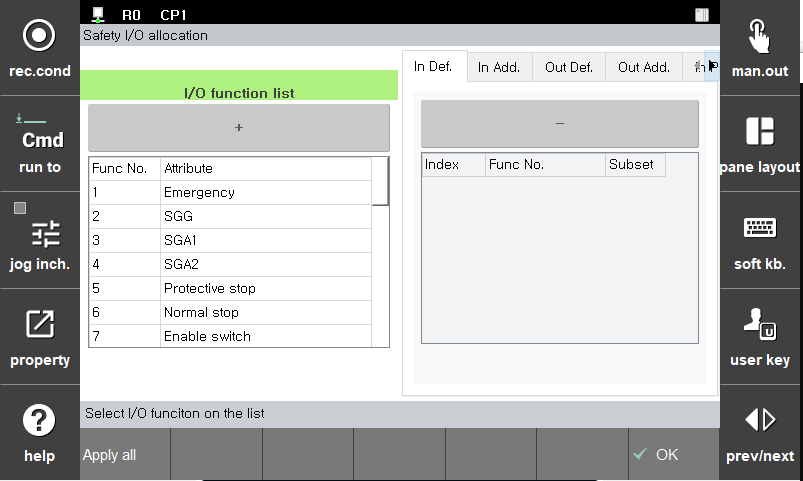
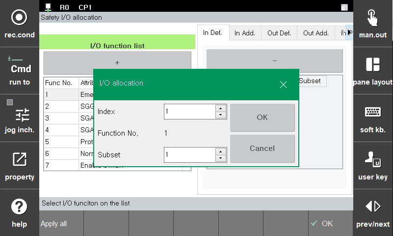

# 3.3.3.3 Linker

Linker는 Default Safety I/O, Additional Safety IO, PROFIsafe I/O 등의 외부신호와 로봇 제어기가 가지고 있는 여러가지 논리적 신호 또는 상태 변수를 연결 시켜주는 역활을 합니다.

- I/O Linker Add : Linker의 설정은 좌측 I/O function list에서 원하는 기능(Function)을 선택한 후 **[+]** 버튼을 누르고 Index(H/W ch or Bit number)를 선택합니다. I/O function list에 따라 Subset을 선택하여 세부 채널을 선택할수 있습니다.

- I/O Linker Delete : Linker 설정의 삭제는 화면 우측에서 Linker의 설정을 하나 선택한뒤 바로 위에 보이는 **[-]** 버튼을 눌러 삭제할 수 있습니다.

 

