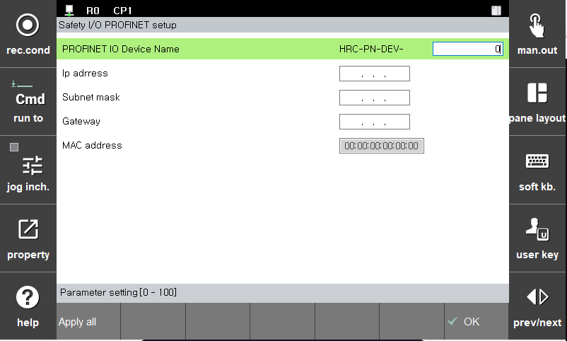

# 3.3.3.4 PROFINET

Profinet의 설정은 다음과 같습니다.

PROFINET의 설정은 BD671의 RS232 통신을 통해 변경할 수 있습니다.
이번장에서는 PROFINET과 관련된 파라미터에 관해서만 설명합니다.

 - S : Sub Module을 추가합니다.
 - s : Sub Module을 제거합니다.
 - H : 현재 설치된 Sub Module의 리스트를 보여줍니다.
 - n :  PROFINET 장치의 이름을 설정합니다.
 - N : PROFINET 장치의 MAC address를 설정합니다.
 - o : IP 주소와 Subnet mask 그리고 Gateway 를 설정 합니다. 

> 아래 TP에 의한 파라미터 설정은 준비중에 있습니다.

 - PROFINET IO Device 이름 : PROFINET 장치의 이름을 설정합니다. 장치의 이름 앞 글자는 "HRC-PN-DEV-" 로 고정되어 있고 사용자는 뒤에 붙는 숫자를 선택할 수 있습니다.
 - IP address : IP 주소를 설정 합니다. ex) 192.168.1.100
 - Subnet mask : Subnet mask를 설정합니다. ex)255.255.255.0
 - Gateway : Gateway 주소를 설정합니다. ex)192.168.1.1
 - MAC address : 이 파라미터는 설정할 수 없고 읽기만 가능합니다.