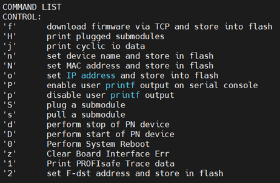
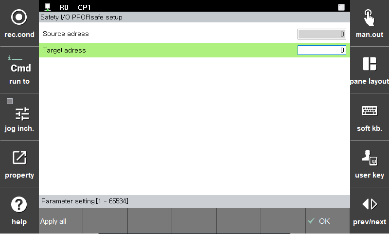


# 3.3.3.5 PROFIsafe

 1. PROFIsafe의 설정은 다음과 같습니다.

 - Source Address : Source Address를 설정합니다. (설정 범위 : 1 ~ 65534)
 - Destination Address : Destination Address를 설정합니다. (설정 범위 : 1 ~ 65534)
Address Type :  Address Type 2 (Source & Destination Address 모두 체크함)

 - Reaction on Device_Fault : 본 장치가 Fault 상태가 되면 모든 F-Output 출력은 Fail-safe상태로 변경됩니다. 그리고 장치의 Fault상태가 해소되고 난 뒤에는 F-Host에서 Global-Ackknoledge 와 같은 명령으로 F-Device를 re-integration 하는 과정이 필요합니다.

> 아래 TP에 의한 파라미터 설정은 준비중에 있습니다.

 - Source Address : Source Address를 설정합니다. (설정 범위 : 1 ~ 65534)
 - Destination Address : Destination Address를 설정합니다. (설정 범위 : 1 ~ 65534)