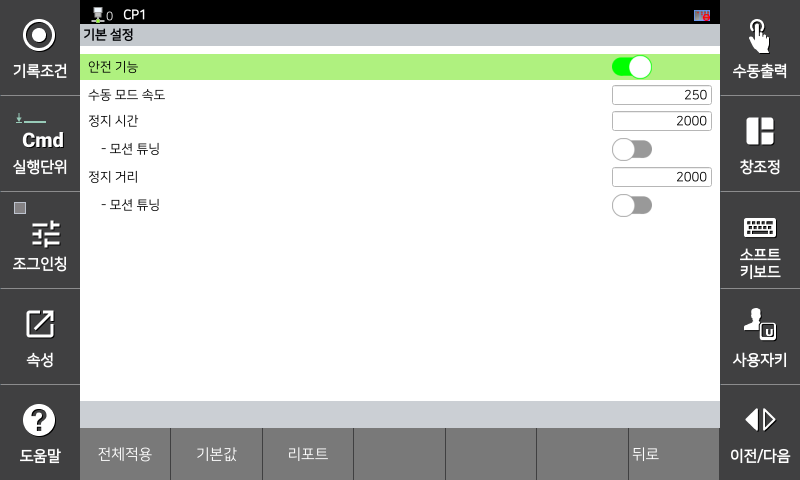

# 3.3.1.1 General

Set the thresholds for essential functions (manual mode speed monitoring, stop time, and stop distance monitoring) required for robot operation. Additionally, configure whether the robot monitoring and area monitoring functions are fully enabled. Even if the robot monitoring and area monitoring functions are enabled, if the safety function is disabled, the monitoring function will not operate. If a monitoring violation occurs, the configured safety stop (Stop 0, Stop 1) will be immediately activated.

You can set parameter values in the `[System > 10: Safety System > 1: General setup > 1: General]` menu.

</img>
<em>
General parameter setting screen
</em>

|  **Parameter** |                       **Description**                       |  **Default setting**  |
| :-------: | :------------------------------------------------: | :-------------: |
| Safety function | 
Whether robot monitoring and area monitoring functions are enabled

(Enable / Disable)
 | Disable |
| Use T/P | 
Enables or disables the use of the TP

(Enable / Disable)
 | Disable |
| 
Manual mode speed

[mm/s]
 | 
Whether the function is enabled

(10 ~ 250)
 | 250 |
| 
Stop time

[ms]
 | 
Stop method when the function is violated

(100 ~ 2000)
 | 2000 |
| - Motion Tuning | 
Tuning to a motion that satisfies the stopping time limit

(Enable / Disable)
 | Disable |
| 
Stopping Distance

[mm]
 | 
Whether each joint is activated

(50 ~ 2000)
 | 2000 |
| - Motion Tuning | 
Tuning to a motion that satisfies the stopping distance limit

(Enable / Disable)
 | Disable |


<strong>[Caution]</strong>: Even if the safety function is set to disabled, the functions that are essential for robot use (manual mode speed, stop time, stop distance monitoring) are not disabled.



<strong>[Caution]</strong>: The stop time and stop distance are the time and distance until the robot actually stops when stop1 is executed, and if the set value is exceeded, stop0 is activated immediately.

 