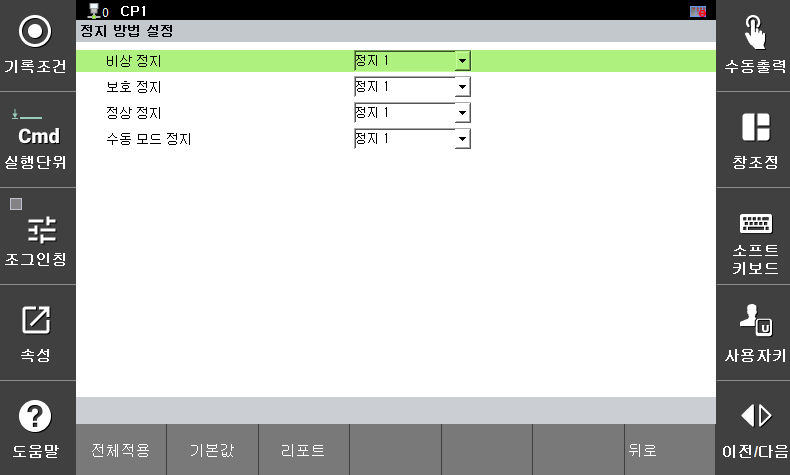

# 3.3.1.2 Stoppeinstellungen

Wählen Sie für jede Sicherheitsfunktion den passenden Sicherheitsstopptyp. Sicherheitsstoppfunktionen bringen den Roboter bei einem Sicherheitsverstoß in einen sicheren Zustand. Es gibt drei Typen: Alle Sicherheitsstoppfunktionen erfüllen die Anforderung 4.2.2.4 der IEC 61800-5-2.

* **Stopp 0**: Alle Motoren in den Verbindungsmodulen werden sofort stromlos geschaltet und angehalten.
* **Stopp 1**: Alle Motoren in den Verbindungsmodulen verlangsamen sich und kommen dann zum Stillstand. Anschließend wird die Stromzufuhr zu den Motoren unterbrochen.
* **Stopp 2**: Alle Motoren in den Verbindungsmodulen verlangsamen sich, und der Not-Aus-Schalter (SOS) wird aktiviert. Die Stromzufuhr zu allen Motoren bleibt bestehen.

Die Art des Stopps aufgrund einer Sicherheitsfunktionsverletzung wird im Menü für die funktionsspezifischen Parametereinstellungen festgelegt.
Sie können die Stoppmethode entsprechend der in ISO 10218-1 geforderten Stoppart (Not-Aus, Schutz-Aus, Normal-Aus) einstellen. 
Informationen zu den Signaleingängen für jeden Stopp finden Sie unter „[**3.3.4 Sicherheitssignal-Ein-/Ausgang**](../../../3-safety-function/3-safety-function/3-safety-io/README.md)“.
Sie können auch die Stoppmethode für den Fall einer Verletzung der Geschwindigkeitsüberwachung im manuellen Modus festlegen. Die Stoppmethode kann zwischen Stopp 0 und Stopp 1 gewählt werden.

Die Parameterwerte können Sie im Menü **\[System > 8: Sicherheitssystem > 1: Grundeinstellungen > 2: Stoppeinstellungen]** festlegen.

</img>
<em>
정지 설정 화면
</em>

|  **Parameter** |                       **Beschreibung**                       |  **Standardwert**  |
| :-------: | :------------------------------------------------: | :-------------: |
| Not-Aus | 
Wählen Sie den Stopptyp für den Not-Aus

(Stop 0, Stop 1)
 | Stop 1 |
| Schutzstopp | 
Wählen Sie den Stopptyp für den Schutzstopp

(Stop 0, Stop 1, Stop 2)
 | Stop 1 |
| Normalstopp | 
Wählen Sie den Stopptyp für den Normalstopp

(Stop 0, Stop 1)
 | Stop 1 |
| Manueller Stopp | 
Stoppen bei Geschwindigkeitsüberschreitung im manuellen Modus

(Stop 0, Stop 1)
 | Stop 1 |


**\[Vorsicht]**: Für jede Funktion müssen geeignete Abschaltmethoden durch Risikobewertung festgelegt und vor der Inbetriebnahme verifiziert werden.  

 