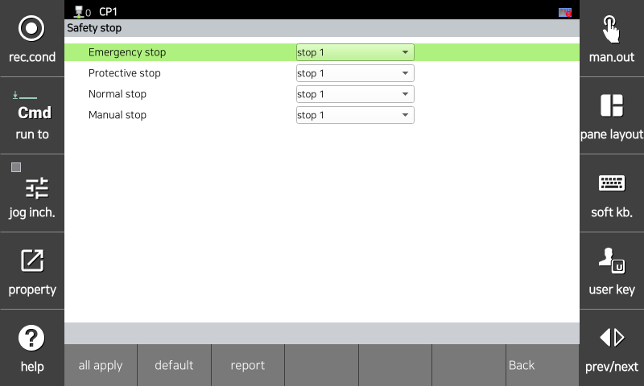

# 3.3.1.2 Stop Settings

Set the appropriate safe stop type for each safety function. Safe stop functions stop the robot to a safe state when a safety violation occurs. There are three types: All types of safe stop functions comply with Requirement 4.2.2.4 of IEC 61800-5-2.

* **Stop 0**: Immediately remove power from all motors in the joint modules and stop.
* **Stop 1**: All motors in the joint modules decelerate and then stop. Power is then removed from the motors.
* **Stop 2**: All motors in the joint modules decelerate and SOS (Safe Operating Stop) is activated. Power is maintained to all motors.

The stop type due to a safety function violation is set in the function-specific parameter setting menu.
You can set the stop method according to the stop type (emergency stop, protective stop, normal stop) required by ISO 10218-1.
For signal inputs for each stop, refer to "[3.3.4 Safety Signal Input/Output](../../../3-safety-function/3-safety-function/4-safety-io/README.md)."
You can also set the stop method to be performed when the manual mode speed monitoring is violated. The stop method can be selected from Stop 0 or Stop 1.

You can set the parameter values in the `[System > 10: Safety System > 1: General setup > 2: Safe Stop]` menu.

</img>
<em>
Stop parameter setting screen
</em>

|  **Parameter** |                       **Description**                       |  **Default value**  |
| :-------: | :------------------------------------------------: | :-------------: |
| Emergency stop | 
Select the stop type to apply in case of emergency stop

(Stop 0, Stop 1)
 | Stop 1 |
| Protective stop | 
Select the stop type to apply in case of protective stop

(Stop 0, Stop 1, Stop 2)
 | Stop 1 |
| Normal stop | 
Select the stop type to apply in case of normal stop

(Stop 0, Stop 1)
 | Stop 1 |
| Manual stop | 
Select the stop type to apply in case of manual mode stop

(Stop 0, Stop 1)
 | Stop 1 |


<strong>[Caution]</strong>: Appropriate stopping methods for each function must be established through risk assessment, and verification must be performed before operation. 

 
 
<strong>[Attention]</strong>: Les méthodes d'arrêt appropriées pour chaque fonction doivent être établies au moyen d'une évaluation des risques, et une vérification doit être effectuée avant la mise en fonctionnement.
