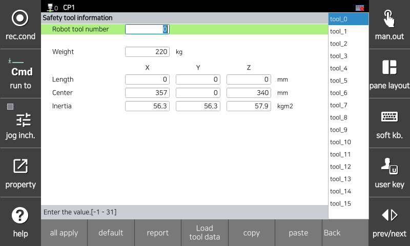

# 3.3.1.3 Safety Tool Information

Safety tool information is used by the safety board to calculate the robot's speed and position. You must enter the tool information attached to the actual robot. The tool information must be identical to the tool number used for robot control `[System > 3: Robot Parameters > 1: Tool Data]`.

You can set safety tool information in the `[System > 10: Safety System > 1: General setup > 3: Safety Tool Information]` menu. After setting the robot tool number, you can load tool information used for robot control by clicking [Load Tool Data] at the bottom of the menu.

</img>
<em>
Safety tool parameter setting screen
</em>

|  **Parameter** |                       **Description**                       |  **Default value**  |
| :-------: | :------------------------------------------------: | :-------------: |
| 
Robot tool number
 | 
Tool number used by the robot. A value of -1 indicates that it is not used.

(-1 ~ 31)
 | -1 |
| 
Weight

[kg]
 | 
Weight of the tool

(0.0 ~ 1000.0)
 | 0.0 |
| 
Length

[mm]
 | 
Length of the tool

(-3000.0 ~ 3000.0)
 | 0.0 |
| 
Center

[mm]
 | 
Location of the center of gravity of the tool relative to the center of the flange

(-3000.0 ~ 3000.0)
 | 0.0 |
| 
Inertia

[kg·㎡]
 | 
Moment of inertia of the tool with respect to the tool coordinates

(0.0 ~ 2000.000)
 | 0.0 |
| Load Tool Data | A function to load tool information used for robot control according to the tool number | - |
| Copy | A function to copy the values   entered on the corresponding page | - |
| Paste | A function to paste the values   of the copied page onto the corresponding page | - |


<strong>[Caution]</strong>: If the safety tool information does not match the tool information used for robot control, a warning/error will occur and the robot will not operate. Be sure to match the actual tool information with the safety tool information before operating the robot.



<strong>[Attention]</strong> : Si les informations relatives à l'outil de sécurité ne correspondent pas aux informations sur l'outil utilisées pour la commande du robot, un avertissement/une erreur se produira et le robot ne fonctionnera pas. Assurez-vous de faire correspondre les informations réelles de l'outil avec les informations de l'outil de sécurité avant de faire fonctionner le robot.

