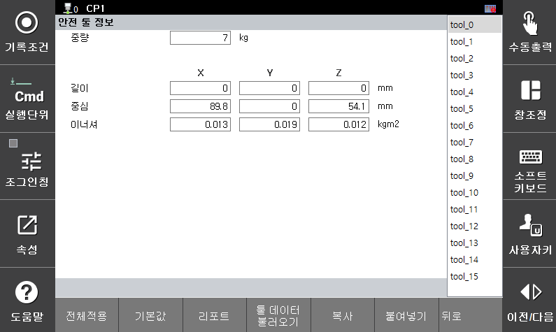

# 3.3.1.3 안전 툴 정보

안전 툴 정보는 안전 보드에서 로봇의 속도와 위치를 계산하는 데에 사용합니다. 실제 로봇에 부착된 툴 정보를 입력해야 하며, 로봇 제어에 사용하는 툴 정보(**\[시스템 > 3: 로봇 파라미터 > 1: 툴 데이터]**)와 동일한 툴 번호에 동일한 톨 정보를 입력해야 합니다. 

**\[시스템 > 8: 안전 시스템 > 1: 기본 설정 > 3: 안전 툴 정보]** 메뉴에서 안전 툴 정보를 설정할 수 있으며, 메뉴 하단의 "툴 데이터 불러오기" 로 로봇 제어에 사용하는 툴 정보를 불러올 수 있습니다. 

</img>
<em>
안전 툴 정보 설정 화면
</em>

|  **파라미터** |                       **설명**                       |  **기본 설정값**  |
| :-------: | :------------------------------------------------: | :----------: |
| 
중량

[kg]
 |  
툴의 중량

(0.0 ~ 1000.0)
  | 0.0 |
| 
길이

[mm]
 | 
툴의 길이

(-3000.0 ~ 3000.0)
 | 0.0 |
| 
중심

[mm]
 |   
플랜지 중심을 기준으로 툴의 무게 중심 위치

(-3000.0 ~ 3000.0)
  | 0.0 |
| 
이너셔

[㎏·㎡]
 |   
툴 좌표에 대한 툴의 관성 모멘트

(0.0 ~ 2000.000)
  | 0.0 |
| 툴 데이터 불러오기 | 로봇 제어에 사용하는 툴 정보를 툴 번호에 맞게 불러오는 기능   | - |
| 복사 | 해당 페이지에 입력한 값을 복사하는 기능   | - |
| 붙여넣기 | 복사한 페이지의 값을 해당 페이지에 붙여넣는 기능   | - |


**\[주의]**: 안전 툴 정보와 로봇 제어에 사용하는 툴정보가 일치하지 않으면, 경고/에러가 발생하며 로봇을 구동할 수 없습니다. 반드시 로봇 구동 전 툴 정보를 실제 부착된 툴 정보와 일치시켜 주십시오.  

 

**\[주의]**: 안전 툴 번호는 0 ~ 15까지 지원됩니다. 시스템의 툴 정보를 16 ~ 31을 사용하는 경우, 안전 툴 번호 0과 툴 정보를 일치시켜 주십시오. 

 