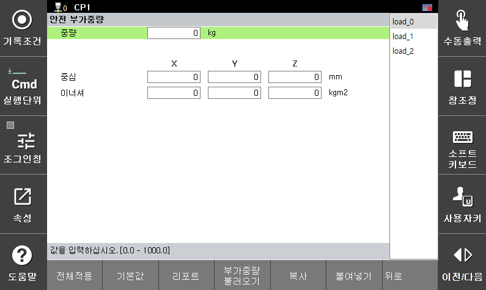

# 3.3.1.4 안전 부가중량

안전 부가중량 정보는 안전 보드에서 로봇의 토크를 계산하는 데에 사용합니다. 실제 로봇에 설치된 부가 중량의 정보를 입력해야 하며, 로봇 제어에 사용하는 부가 중량 정보(`[시스템 > 3: 로봇 파라미터 > 7: 축별 부가중량]`)와 동일한 정보를 입력해야 합니다. 

* `[시스템 > 10: 안전 시스템 > 1: 기본 설정 > 4: 안전 부가중량]`  메뉴에서 안전 부가중량 정보를 설정할 수 있으며, 메뉴 하단의 "`부가중량 불러오기`"로 로봇 제어에 사용하는 부가중량 정보를 불러올 수 있습니다. 

</img>
<em>
안전 부가중량 설정 화면
</em>

|  **파라미터** |                       **설명**                       |  **기본 설정값**  |
| :-------: | :------------------------------------------------: | :----------: |
| 
중량

[kg]
 |  
툴의 중량

(0.0 ~ 1000.0)
  | 0.0 |
| 
중심

[mm]
 |   
플랜지 중심을 기준으로 툴의 무게 중심 위치

(-3000.0 ~ 3000.0)
  | 0.0 |
| 
이너셔

[kg·㎡]
 |   
툴 좌표에 대한 툴의 관성 모멘트

(0.0 ~ 2000.000)
  | 0.0 |
| 부가중량 불러오기 | 로봇 제어에 사용하는 부가중량 정보를 불러오는 기능   | - |
| 복사 | 해당 페이지에 입력한 값을 복사하는 기능   | - |
| 붙여넣기 | 복사한 페이지의 값을 해당 페이지에 붙여넣는 기능   | - |


**\[주의]**: 안전 부가중량 정보와 로봇 제어에 사용하는 부가중량 정보가 일치하지 않으면, 경고/에러가 발생하며 로봇을 구동할 수 없습니다. 반드시 로봇 구동 전 부가중량 정보를 실제 부착된 부가중량과 일치시켜 주십시오.  

 

**\[주의]**: 안전 부가중량 번호는 0 ~ 2까지 지원되며, 각 번호는 시스템 부가중량의 축번호와 매칭됩니다(0-S축, 1-H축, 2-V축). 안전 파라미터 번호와 축 번호를 일치시켜 부가중량 정보를 입력해주시기 바랍니다. 

 
 