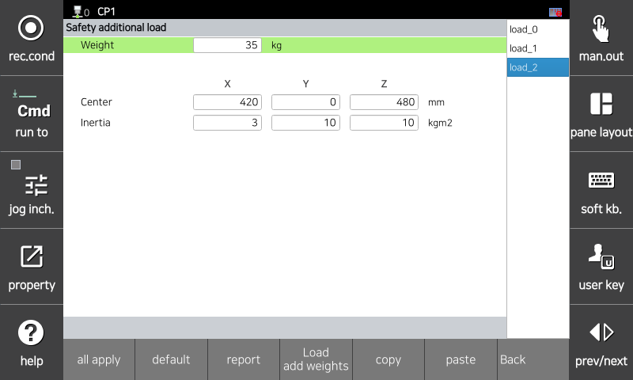

# 3.3.1.4 安全附加重量

安全附加重量信息用于安全板计算机器人的扭矩。您必须输入实际安装在机器人上的附加重量的信息。该信息必须与用于机器人控制的附加重量信息完全相同 `[System > 3: Robot Parameter > 7: Additional Weight on Each Axis]`。

* `[System > 10: Safety System > 1: General setup > 4: Safety Additional Load]` 您可以在菜单中设置安全附加重量信息，并可以通过点击菜单底部的“加载附加重量”来加载用于机器人控制的附加重量信息。

</img>
<em>
安全附加重量参数设置屏幕
</em>

|  **参数** |                       **描述**                       |  **默认值**  |
| :-------: | :------------------------------------------------: | :-------------: |
| 
重量

[kg]
 | 
工具的重量

(0.0 ~ 1000.0)
 | 0.0 |
| 
中心

[mm]
 | 
工具的重心相对于法兰中心的位置

(-3000.0 ~ 3000.0)
 | 0.0 |
| 
惯性

[kg·㎡]
 | 
相对于工具坐标的工具的转动惯量

(0.0 ~ 2000.000)
 | 0.0 |
| 加载附加重量 | 一个加载用于机器人控制的附加重量信息的功能 | - |
| 复制 | 复制对应页面上输入的值的功能 | - |
| 粘贴 | 将复制页面的值粘贴到对应页面上的功能 | - |


<strong>[注意]</strong>: 如果安全重量信息和用于机器人控制的重量信息不匹配，将会发生警告/错误，机器人将无法操作。务必在操作机器人之前确认重量信息与实际附加的重量相匹配。

 

<strong>[注意]</strong>: 安全附加重量编号支持从 0 到 2，每个编号与系统附加重量的轴编号相匹配 (0-S 轴，1-H 轴，2-V 轴)。请通过将安全参数编号与轴编号匹配来输入附加重量信息。
