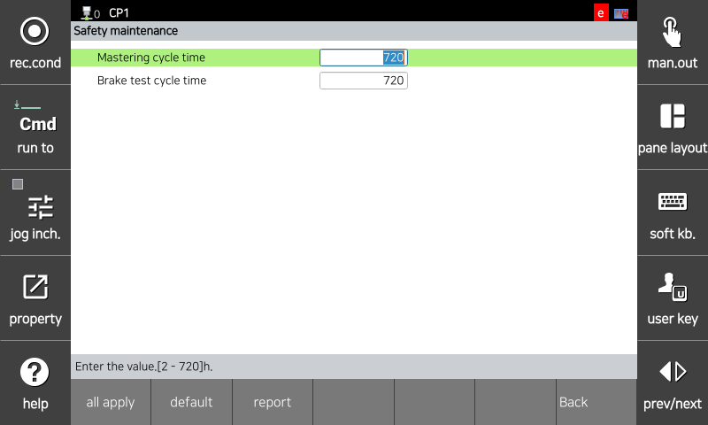

# 3.3.1.5 Maintenance

The Maintenance menu allows you to set the mastering and brake test cycles. Periodic monitoring of the origin and brake status of each robot axis is essential to ensure the performance of safety functions. If the tests fail to complete within the set cycle, Safety Stop 1 is immediately activated.

To perform a brake test,

You can set the parameter values in the `[System > 10: Safety System > 1: General setup > 5: Maintenance]` menu. The Maintenance menu is configured to be accessible only to authorized users.

</img>
<em>
Maintenance parameter setting screen
</em>

|  **Parameter** |                       **Description**                       |  **Default value**  |
| :-------: | :------------------------------------------------: | :-------------: |
| 
Mastering cycle time

[h]
 | 
Mastering test execution cycle

(2 ~ 720)
 | 720 |
| 
Break test cycle time

[h]
| 
Break test execution cycle

(2 ~ 720)
 | 720 |


<strong>[Caution]</strong>: If a crash occurs, we recommend performing a mastering test and a break test.

 