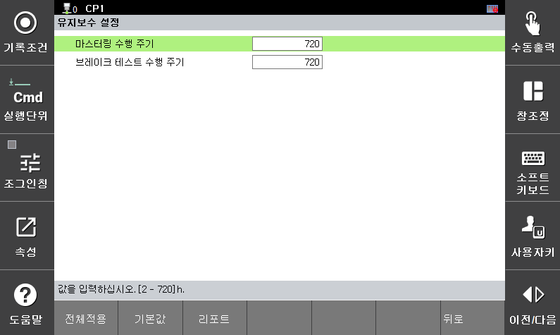

# 3.3.1.5 유지 보수

유지보수 메뉴에서는 마스터링 테스트와 브레이크 테스트 수행 주기를 설정할 수 있습니다. 로봇 각 축의 원점과 브레이크 상태는 주기적으로 관리해야 안전기능의 성능을 보장합니다. 설정한 수행 주기 안에 테스트가 진행되지 않으면 안전 정지1이 즉시 활성화됩니다.

브레이크 테스트 수행 방법은 

`[시스템 > 8: 안전 시스템 > 1: 기본 설정 > 5: 유지 보수]` 메뉴에서 파라미터 값을 설정할 수 있습니다.

</img>
<em>
유지 보수 설정 화면
</em>

|  **파라미터** |                       **설명**                       |  **기본 설정값**  |
| :-------: | :------------------------------------------------: | :----------: |
| 
마스터링 수행 주기

[h]
 |  
마스터링 테스트 수행 주기

(2 ~ 720)
  | 720 |
| 
브레이크 테스트 수행 주기

[h]
| 
브레이크 테스트 수행 주기

(2 ~ 720)
 | 720 |


**\[주의]**: 충돌이 발생했을 경우, 마스터링 테스트와 브레이크 테스트를 수행할 것을 권장합니다.  

 