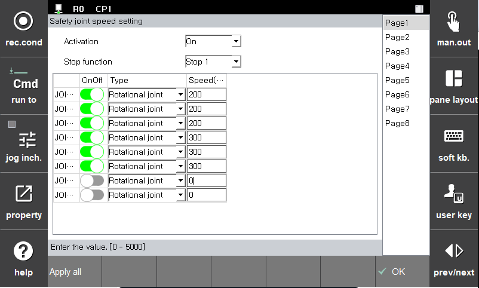

# 3.3.1.2 조인트 속도 제한

조인트 속도 제한 파라미터는 로봇의 조인트 속도를 감시하기 위한 한계값입니다. 한계값 위반 시에는 설정한 안전 정지(정지0, 정지1, 정지2)가 즉시 활성화됩니다.

**\[시스템 > 4: 응용 파라미터 > 18: SafeSpace2.0 > 파라미터 설정 > 로봇 제한 > 조인트 속도 제한]** 메뉴에서 파라미터 값을 설정할 수 있습니다.

|  **파라미터** |                       **설명**                       |  **기본 설정값**  |
| :-------: | :------------------------------------------------: | :----------: |
| Activation | 
기능 활성화 여부

(Off/On/Safety Input)
 |   Off  |
| Stop function |   
기능 위반시 정지 방법

(Stop0, Stop1, Stop2, Non-stop)
  | Stop 1 |
| 모션 튜닝 |   
관절의 속도 제한값을 만족하는 모션으로 튜닝
  |  Off |
| Joint OnOff |   
각 관절의 활성화 여부

(On/Off)
  |  Off |
| speed |   
각 관절의 속도 제한값

(0 ~ 5000 (mm/s))
  |  5000.0 |


**\[주의]**: 속도 감시 기능 설정시에는 반드시 정지 반응 시간을 고려하고 커버를 덮어 충돌 및 부상을 예방하십시오.

 
