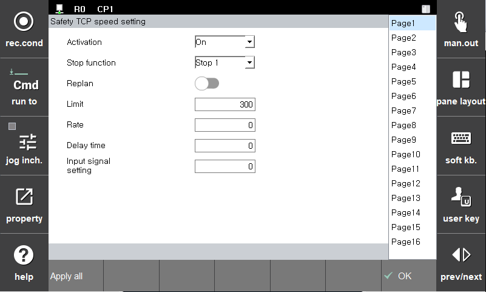

# 3.3.1.4 TCP speed monitoring

This function monitors the TCP speed based on the robot coordinate system. If a monitoring violation occurs, safety stops (Stop0, Stop1, and Stop2) will be actuated immediately.

You can set the parameter values in the **\[System > 4: Application parameter > 18: SafeSpace2.0 > Parameter setup > Robot restriction > TCP speed]** menu.

| **Parameter** | 　　　　　　　　　**Description**                                                  |  **Default setting value** |
| :------: | ---------------------------------------------------------------- | :---------: |
| Activation | 
Activation of TCP speed monitoring function

(Off/On/Safety Input)
 |   Off  |
| Stop function |   
Stop method

(Stop0, Stop1, Stop2, Non-stop)
  | Stop 1 |
| Replan |   
Activation of RePlan function

(On/Off)
  |  Off |
| Limit |   
TCP speed limit

(0 ~ 50000 (mm/s))
  | 50000 |
| Rate |   
Deceleration ratio for Replan

(0 ~ 100 (%))
  | 0 |
| Delay time |   
Monitor changed speed limit after delay time due to RePlan

(0 ~ 1000(ms))
  | 0 |
| Input signal setting |   
 Input signal assignment for replan

(0 ~ 16)
  |  0 |


**\[Caution]**: The safety function is monitored based on the set parameters. In configuring a limit, you must consider the stop reaction time and stopping distance. Before running the robot, verification must be performed.

 