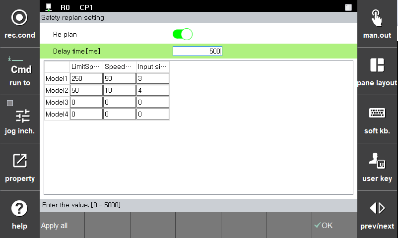

# 3.3.1.5 Re plan

Replan is a function that adjusts the speed of the robot based on a input signal from an external safety sensor. The robot's operating speed is changed at a deceleration rate corresponding to the input signal, and the TCP speed is monitored at a speed corresponding to the delay time. If the delay time is insufficient or the robot is not decelerated enough to violate the TCP speed limit, the safety stop (Stop0, Stop1, Stop2) will be activated immediately.

You can set the parameter values in the **\[System > 4: Application parameter > 18: SafeSpace2.0 > Parameter setup > Robot restriction > Re plan]** menu.

|  **Parameter** |                       **Description**                       |  **Default setting value**  |
| :-------: | :------------------------------------------------: | :----------: |
| Replan |   
Activation of RePlan function

(On/Off)
  |  Off |
| Limit |   
TCP speed limit

(0 ~ 50000 (mm/s))
  | 50000 |
| Rate |   
Deceleration ratio for Replan

(0 ~ 100 (%))
  | 0 |
| Delay time |   
Monitor changed speed limit after delay time due to RePlan

(0 ~ 1000(ms))
  | 0 |
| Input signal setting |   
 Input signal assignment for replan

(0 ~ 16)
  |  0 |


* In configuring a speed limit, you must consider the stop reaction time and put a cover on the target to prevent collisions and injuries.
* Because the speed increases in proportion to kinetic energy and a high payload may increase the robot’s momentum, the collision of the robot with an external object may generate significant impact. In the collaborative operation space, operate the robot while maintaining a safe speed and payload.

