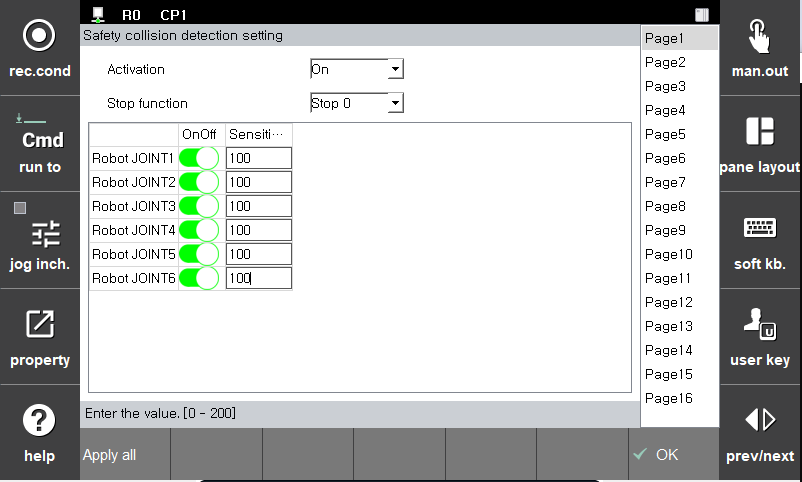

# 3.3.1.6 Collision detection

If the external force applied to the robot exceeds the allowable value, it is recognized as a collision. The sensitivity of each axis can be adjusted. If the sensitivity is higher, the smaller the external force will be recognized as a collision. If a monitoring violation occurs, safety stops (Stop0, Stop1, and Stop2) will be actuated immediately.

You can set the parameter values in the **\[System > 4: Application parameter > 18: SafeSpace2.0 > Parameter setup > Robot restriction > Collision detection]** menu.

| **Parameter** | 　　　　　　　　　**Description**                                                  |  **Default setting value** |
| :------: | ---------------------------------------------------------------- | :---------: |
| Activation | 
Activation of function

(Off/On/Safety Input)
 |   Off  |
| Stop function |   
Stop method

(Stop0, Stop1, Stop2, Non-stop)
  | Stop 1 |
| Joint OnOff |   
Activation of each joint

(On/Off)
  |  Off |
| Sensitivity |   
The sensitivity of the collision detection function

(0 ~ 200 (%))
  |  100 |


* Because the speed increases in proportion to kinetic energy and a high payload may increase the robot’s momentum, the collision of the robot with an external object may generate significant impact. In the collaborative operation space, operate the robot while maintaining a safe speed and payload.
* If the tool and additional load information are set differently from the actual one, error detection would be occured incorrectly. Please check the information before using the function.

