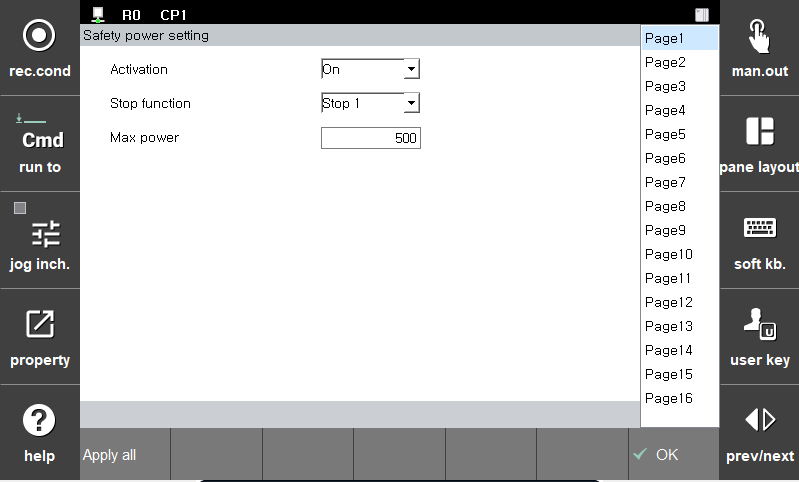

# 3.3.1.7 파워 감시

로봇이 발생하는 힘에 대해 허용치를 초과하는지 감시하는 기능입니다. 모니터링 위반 시에는 안전 정지(정지0, 정지1, 정지2)가 즉시 활성화됩니다.

**\[시스템 > 4: 응용 파라미터 > 18: SafeSpace2.0 > 1: 안전 기능 > 파라미터 설정 > 로봇 제한 > 파워 감시]** 메뉴에서 파라미터 값을 설정할 수 있습니다.

| **파라미터** | 　　　　　　　　　**설명**                                                  |  **기본 설정값** |
| :------: | ---------------------------------------------------------------- | :---------: |
| Activation | 
기능 활성화 여부

(Off/On/Safety Input)
 |   Off  |
| Stop function |   
기능 위반시 정지 방법

(Stop0, Stop1, Stop2, Non-stop)
  | Stop 1 |
| 모션 튜닝 |   
로봇의 파워 제한값을 만족하는 모션으로 튜닝
  |  Off |
| 파워 |   
로봇의 파워 제한값

(80 ~ 1000 (W))
  | 1000 |


* 운동 에너지에 비례하여 속도가 높고 가반 하중이 큰 경우 로봇의 충격량이 커질 수 있으므로 로봇이 외부의 물체와 충돌하는 경우 상당한 수준의 충격이 발생할 수 있습니다. 협동 공간에서는 안전한 속도와 가반 하중을 유지하여 운전하십시오.
* 툴 정보 및 부가 중량을 실제와 다르게 설정하면 오감지가 발생할 수 있습니다. 기능 사용 전 정보를 확인해주십시오.

