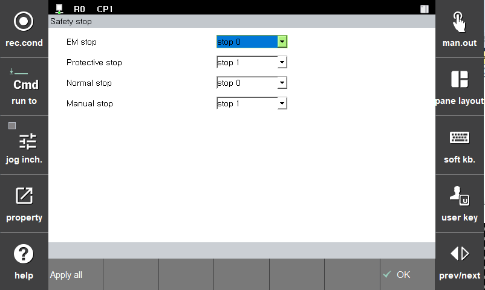

# 3.3.1.9 安全停止功能

根据各安全功能设置适当的安全停止类型。安全停止功能是在发生安全违规时，为使系统进入安全状态而停止机器人，有以下三种类型。所有类型的安全停止功能都满足IEC 61800-5-2的4.2.2.4要求。

* **停止0：立即切断所有关节模块的电机电源并停止。**: 모든 조인트 모듈의 모터 전원을 즉시 제거하고 정지
* **停止1：所有关节模块的电机减速后停止。之后切断电机电源。**: 모든 조인트 모듈의 모터가 감속 후 정지. 이후에 모터의 전원 제거
* **停止2：所有关节模块的电机减速后执行SOS（Safe Operating Stop）。此时所有电机保持供电状态。**: 모든 조인트 모듈의 모터가 감속 후 SOS (Safe Operating Stop)가 동작. 모든 모터의 전원 공급 유지 상태

来自安全功能违规的停止类型在各功能的参数设置菜单中设置。
ISO 10218-1对停止要求的停止类型设置如下：

*\[系统 > 4: 应用参数 > 18: SafeSpace2.0 > General setup > Safety stop]**菜单中，可以设置参数值。

|  **|  参数 |                       说明                       |  默认设定值  |** |                       **|  参数 |                       说明                       |  默认设定值  |**                       |  **|  参数 |                       说明                       |  默认设定值  |**  |
| :-------: | :------------------------------------------------: | :----------: |
| EM stop |  
紧急停止

(Stop 0, Stop 1)
  | Stop 0 |
| Protective stop | 
保护停止

(Stop 0, Stop 1, Stop 2)
 |   Stop 0 |
| Normal stop |   
普通停止

(Stop 0, Stop 1)
  | Stop 0 |
| Manual stop |   
手动模式速度违规时停止

(Stop 0, Stop 1)
  |  Stop 0 |


*\[注意]**：必须通过风险评估为各项功能设置适当的停止方法。

