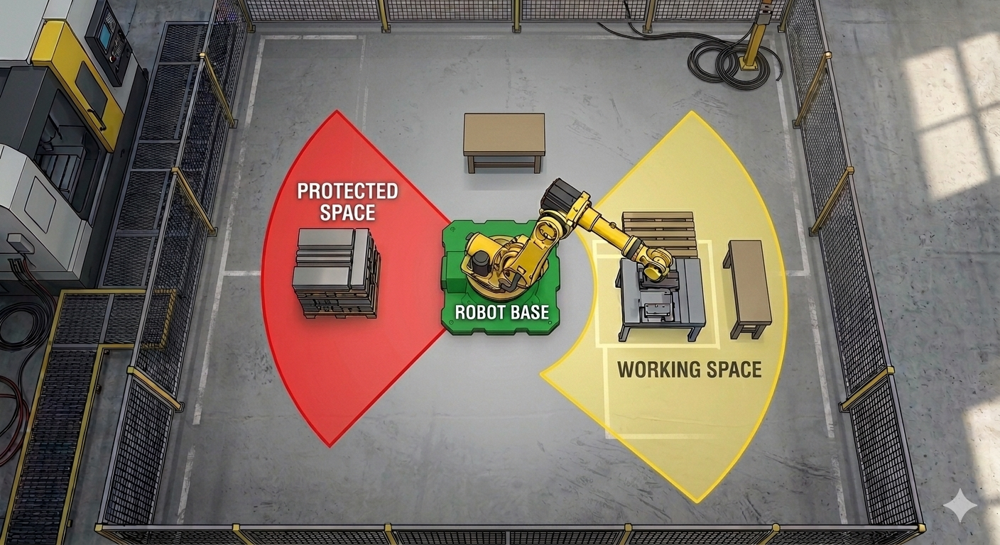
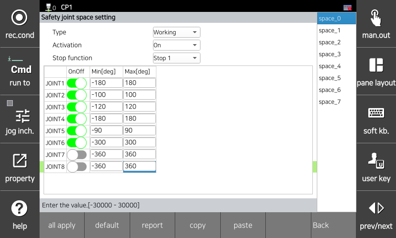

# 3.3.2.1 Joint Angle Limit Setting

The Joint Area Setting parameter is a limit value for monitoring safety functions in the robot's joint space. If the monitoring is violated, the specified safety stop (Stop 0, Stop 1, or Stop 2) is immediately activated.

</img>
<em>
Joint area setting example (S-axis)
</em>

You can set parameter values   in the `[System > 8: Safety System > 2: Parameter Settings > 1: Robot Limits > 1: Joint Area]` menu.

</img>
<em>
Joint area parameter setting screen
</em>

|  **Parameter** |                       **Description**                       |  **Default Setting**  |
| :-------: | :------------------------------------------------: | :----------: |
| Type | 
Safety Area Type

(Work Area / Protection Area)
 | Work Area |
| Activation | 
Whether the function is activated

(Invalid / Valid / Safe I/O)
 | Invalid |
| Stop Method | 
Stop method in case of function violation

(Stop 0 / Stop 1 / Stop 2 / No Stop)
 | Stop 1 |
| Joint Activation | 
Whether each joint is activated

(Active / Inactive)
 | Inactive |
| 
Minimum

[deg]
 | 
Angle limit value for each joint

(-360.0 ~ 360.0)
 | -360.0 |
| 
Maximum

[deg]
 | 
Angle limits for each joint

(-360.0 ~ 360.0)
 | 360.0 |


*\[Caution]**: The safety function monitors based on the set area. The set area should be configured considering the stop distance, and verification must be performed before operation.

 