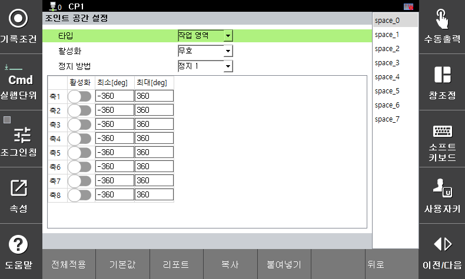

# 3.3.2.1 조인트 영역 설정

조인트 영역 설정 파라미터는 로봇의 조인트 공간에서 안전 기능을 모니터링하기 위한 한계값입니다. 모니터링 위반 시에는 설정한 안전 정지(정지 0, 정지 1, 정지 2)가 즉시 활성화됩니다.

</img>
<em>
조인트 영역 설정 예(S축)
</em>

`[시스템 > 10: 안전 시스템 > 2: 파라미터 설정 > 1: 로봇 제한 > 1: 조인트 영역]` 메뉴에서 파라미터 값을 설정할 수 있습니다.

</img>
<em>
조인트 영역 파라미터 설정 화면
</em>

|  **파라미터** |                       **설명**                       |  **기본 설정값**  |
| :-------: | :------------------------------------------------: | :----------: |
| 타입 |  
안전영역의 종류

(작업 영역 / 보호 영역)
  | 작업 영역 |
| 활성화 | 
기능 활성화 여부

(무효 / 유효 / 안전 입출력)
 | 무효 |
| 정지 방법 |   
기능 위반시 정지 방법

(정지 0 / 정지 1 / 정지 2 / 무정지)
  | 정지 1 |
| 조인트 활성화 |   
각 관절의 활성화 여부

(활성화 / 비활성화)
  | 비활성화 |
| 
최소

[deg]
 |   
각 관절의 각도 제한값

(-360.0 ~ 360.0)
  | -360.0 |
| 
최대

[deg]
 |   
각 관절의 각도 제한값

(-360.0 ~ 360.0)
  |  360.0 |


**\[주의]**: 안전기능은 설정한 영역을 기반으로 감시합니다. 설정한 영역이 정지거리를 감안하여 설정해야 하며, 구동 전 반드시 검증을 수행해야합니다.  

 