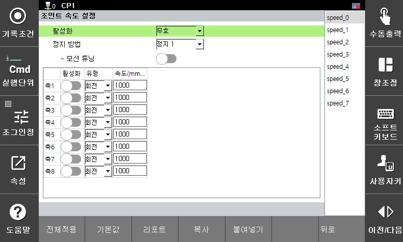

# 3.3.2.2 关节速度限制

关节速度设定参数是用于监控机器人关节速度的限值。如果超出该限值，则会立即触发指定的安全停止（停止0、停止1或停止2）。

</img>
<em>
关节速度设定示例
</em>

您可以在 **\[系统 > 8：安全系统 > 2：参数设置 > 1：机器人限制 > 2：关节速度]** 菜单中设置参数值。

</img>
<em>
关节速度设置参数设置屏幕
</em>

|  **参数** |                       **说明**                       |  **默认设定值**  |
| :-------: | :------------------------------------------------: | :----------: |
| 激活 | 
功能是否激活

（无效 / 有效 / 安全 I/O）
 | 无效 |
| 停止方法 | 
违反功能时的停止方法

（停止 0 / 停止 1 / 停止 2 / 不停止）
 | 停止 1 |
| 运动调整 | 
调整运动至不超过关节速度限制的状态

（启用 / 禁用）
 | 禁用 |
| 关节激活 | 
每个关节是否激活

（激活/禁用）
 | 禁用 |
| 类型 | 
每个关节的操作类型

（旋转/线性）
 | 旋转 |
| 
速度

[mm/s]
 | 
每个关节的速度限制

（0 ~ 10000）
 | 1000.0 |


**\[注意]**：设置速度监控功能时，务必考虑停车反应时间，并盖好盖子以防止碰撞和受伤。

 
