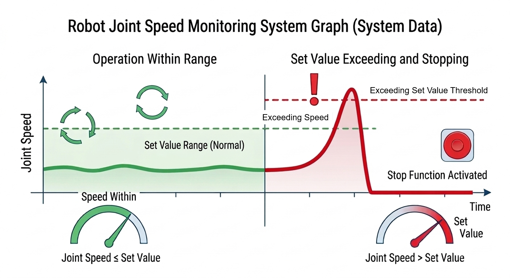

# 3.3.2.2 Joint Speed Limit

The Joint Speed Setting parameter is a limit value for monitoring the robot's joint speed. If the limit value is violated, the specified safety stop (Stop 0, Stop 1, or Stop 2) is immediately activated.

</img>
<em>
Joint speed setting example
</em>

You can set parameter values   in the `[System > 10: Safety System > 2: Parameter setup > 1: Robot restriction > 2: Joint speed]` menu.

</img>
<em>
Joint speed setting parameter setting screen
</em>

|  **Parameter** |                       **Description**                       |  **Default Setting**  |
| :-------: | :------------------------------------------------: | :----------: |
| Activation | 
Whether the function is activated

(OFF / ON / Safety I/O)
 | OFF |
| Stop function | 
Stop method when the function is violated

(Stop 0 / Stop 1 / Stop 2 / No stop)
 | Stop 1 |
| Motion Tuning | 
Tuning to a motion that does not exceed the joint's speed limit

(Active / Disable)
 | Disable |
| Joint ON/OFF | 
Whether each joint is activated

(ON / OFF)
 | OFF |
| 
Speed

[mm/s]
 | 
Speed limit for each joint

(10 ~ 10000)
 | 1000.0 |


<strong>[Caution]</strong>: When setting the speed monitoring function, be sure to consider the stopping reaction time and cover the cover to prevent collisions and injuries.

 

<strong>[Attention]</strong> : Lors du réglage de la fonction de surveillance de la vitesse, veillez à tenir compte du temps de réaction à l'arrêt et à couvrir le carter de protection afin d'éviter les collisions et les blessures.

