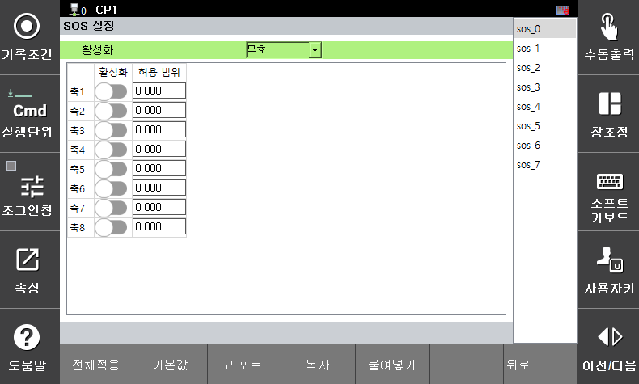

# 3.3.2.3 Gelenkstoppüberwachung

Die Stoppüberwachung überwacht jede Achse auf abnormale Bewegungen während des Roboterstopps. Wird ein festgelegter Grenzwert überschritten, wird sofort ein Sicherheitsstopp (Stopp 0) ausgelöst.

Parameterwerte können im Menü **\[System > 8: Sicherheitssystem > 1: Parametereinstellungen > 1: Robotergrenzwerte > 3: Gelenkstopp]** eingestellt werden.

</img>
<em>
Bildschirm für die Parametereinstellungen der Überwachung beenden
</em>

|  **Parameter** |                       **Beschreibung**                       |  **Standardeinstellung**  |
| :-------: | :------------------------------------------------: | :----------: |
| Aktivierung | 
Funktion aktiviert

(Ungültig / Gültig / Sichere E/A)
 | Ungültig |
| Gelenkaktivierung | 
Jedes Gelenk aktiviert

(Aktiv / Deaktiviert)
 | Deaktiviert |
| 
Zulässiger Bereich

[Grad]
 | 
Winkelgrenzwert für jedes Gelenk

(0,0 ~ 3,0)
 | 0,001 |


**\[Vorsicht]**: Wenn die Überwachungsparameter nicht eingehalten werden, muss vor dem Neustart unbedingt überprüft werden, ob sich der Roboter normal bewegt.
