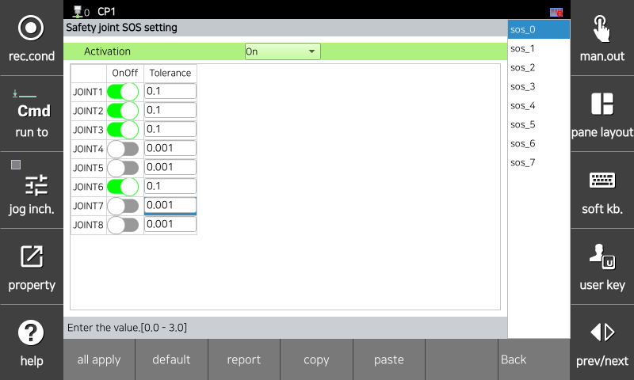

# 3.3.2.3 Joint Stop Monitoring

Stop monitoring monitors each axis for abnormal movement during robot stop operations. If a set limit is violated, a safety stop (Stop 0) is immediately activated.

Parameter values   can be set in the `[System > 10: Safety System > 2: Parameter setup > 1: Robot restriction > 3: Joint SOS]` menu.

</img>
<em>
Stop Monitoring Parameter Setting Screen
</em>

|  **Parameter** |                       **Description**                       |  **Default Setting**  |
| :-------: | :------------------------------------------------: | :----------: |
| Activation | 
Whether the function is activated

(OFF / ON / Safety I/O)
 | OFF |
| Joint ON/OFF | 
Whether each joint is activated

(ON / OFF)
 | OFF |
| 
Tolerance

[deg]
 | 
Angle Limit Value for Each Joint

(0.0 ~ 3.0)
 | 0.100 |


<strong>[Caution]</strong>: If the stop monitoring parameters are violated, be sure to check that the robot's movement is normal before restarting.
