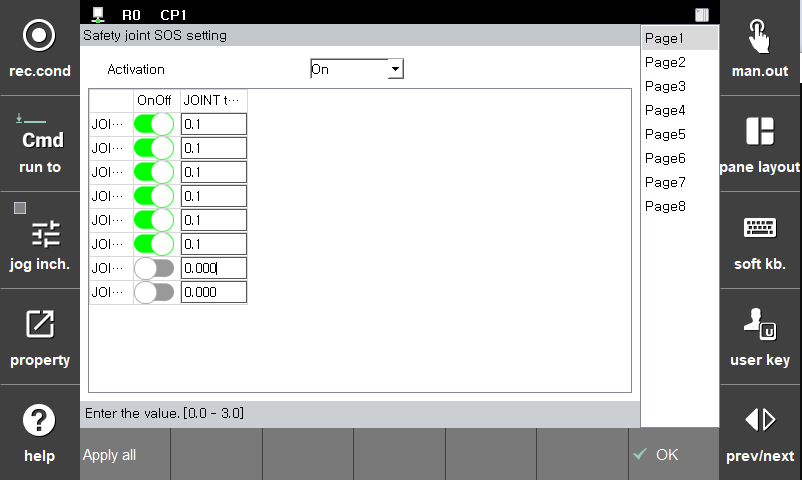

# 3.3.2.3 Joint Stop Monitoring

Stop monitoring monitors each axis for abnormal movement during robot stop operations. If a set limit is violated, a safety stop (Stop 0) is immediately activated.

Parameter values   can be set in the **\[System > 8: Safety System > 1: Parameter Settings > 1: Robot Limits > 3: Joint Stop]** menu.

</img>
<em>
Stop Monitoring Parameter Setting Screen
</em>

|  **Parameter** |                       **Description**                       |  **Default Setting**  |
| :-------: | :------------------------------------------------: | :----------: |
| Activation | 
Whether the function is activated

(Invalid / Valid / Safe I/O)
 | Invalid |
| Joint Activation | 
Whether each joint is activated

(Active / Disabled)
 | Disabled |
| 
Allowable Range

[deg]
 | 
Angle Limit Value for Each Joint

(0.0 ~ 3.0)
 | 0.001 |


**\[Caution]**: If the stop monitoring parameters are violated, be sure to check that the robot's movement is normal before restarting.
