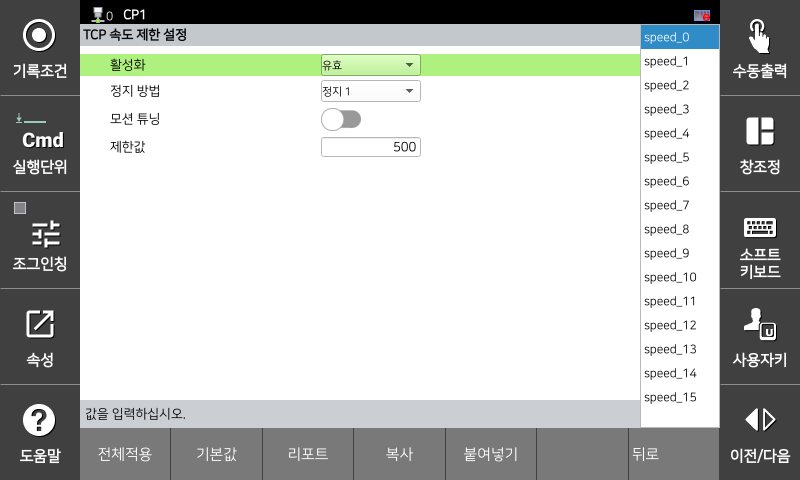

# 3.3.2.4 TCP 속도 제한 설정

로봇 좌표계 기준 TCP의 속도를 감시하는 기능입니다. 모니터링 위반 시에는 안전 정지(정지 0, 정지 1, 정지 2)가 즉시 활성화됩니다.

`[시스템 > 10: 안전 시스템 > 2: 파라미터 설정 > 1: 로봇 제한 > 4: TCP 속도]` 메뉴에서 파라미터 값을 설정할 수 있습니다.

</img>
<em>
TCP 속도 파라미터 설정 화면
</em>

| **파라미터** |                                  **설명**                                  |  **기본 설정값** |
| :------: | :----------------------------------------------------------------: | :---------: |
| 활성화 | 
기능 활성화 여부

(무효 / 유효 / 안전 입출력)
 |  무효  |
| 정지 방법 |   
기능 위반시 정지 방법

(정지 0 / 정지 1 / 정지 2 / 무정지)
  | 정지 1 |
| 모션 튜닝 |   
TCP 속도 제한값을 초과하지 않는 모션으로 튜닝

(활성화 / 비활성화)
  | 비활성화 |
| 
속도 제한 값

[mm/s]
 |   
TCP 속도 제한값

(1 ~ 50000)
  | 50000 |


**\[주의]**: 속도 감시 기능 설정시에는 반드시 정지 반응 시간을 고려하고 커버를 덮어 충돌 및 부상을 예방하십시오.

 