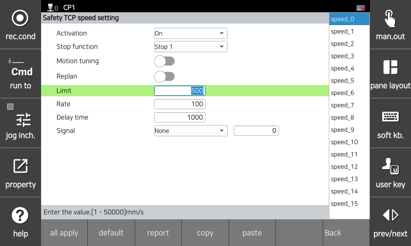

# 3.3.2.4 TCP速度限制设置

此功能监控与机器人坐标系统相关的TCP速度。如果发生监控违规，将立即激活安全停止（停止0、停止1或停止2）。

您可以在`[系统 > 10: 安全系统 > 2: 参数设置 > 1: 机器人限制 > 4: TCP速度]`菜单中设置参数值。

</img>
<em>
TCP速度参数设置屏幕
</em>

| **参数** |                                  **描述**                                  |  **默认设置** |
| :------: | :----------------------------------------------------------------: | :---------: |
| 激活 | 
是否激活此功能

(OFF / ON / Safety I/O)
 | OFF |
| 停止功能 | 
功能违规时的停止方式

(停止0 / 停止1 / 停止2 / 不停止)
 | 停止1 |
| 动作调优 | 
调优以使运动不超过TCP速度限制

(启用 / 禁用)
 | 禁用 |
| 重新规划 | 
是否根据输入信号使用速度调整功能

(启用 / 禁用)
 | 禁用 |
| 
限制

[mm/s]
 | 
TCP速度限制值

(0 ~ 50000)
 | 50000 |
| 
比率

[%]
 | 
在重新调整速度时使用的减速比

(0 ~ 100)
 | 100 |
| 
延迟时间

[ms]
 | 
通过重新调整速度改变速度时，在延迟时间后监控已更改的速度限制值

(0 ~ 1000)
 | 1000 |
| 
信号

[类型, 号码]
 | 
用于速度重新调整的输入信号

( [无, -] / [安全输入, 1~8] / [安全通信, 1~64] )
 | 0 |


<strong>[注意]</strong>: 设置速度监控功能时，请务必考虑停止反应时间，并覆盖以防止碰撞和伤害。
