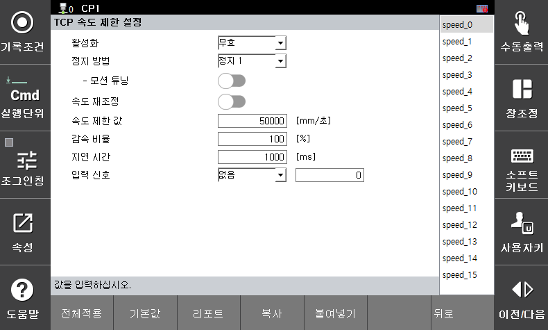

# 3.3.2.4 TCP Speed ​​Limit Setting

This function monitors the TCP speed relative to the robot coordinate system. If a monitoring violation occurs, a safety stop (Stop 0, Stop 1, or Stop 2) is immediately activated.

You can set the parameter values ​​in the **\[System > 8: Safety System > 2: Parameter Settings > 1: Robot Limits > 4: TCP Speed]** menu.

</img>
<em>
TCP speed parameter setting screen
</em>

| **Parameter** |                                  **Description**                                  |  **Default Setting** |
| :------: | :----------------------------------------------------------------: | :---------: |
| Activate | 
Whether the function is activated

(Invalid / Valid / Safe I/O)
 | Invalid |
| Stop method | 
Stop method in case of function violation

(Stop 0 / Stop 1 / Stop 2 / No stop)
 | Stop 1 |
| Motion tuning | 
Tuning to a motion that does not exceed the TCP speed limit

(Enable / Disable)
 | Disable |
| Speed ​​readjustment | 
Whether to use the speed adjustment function according to the input signal

(Enable / Disable)
 | Disable |
| 
Speed ​​limit value

[mm/s]
 | 
TCP speed limit value

(0 ~ 50000)
 | 50000 |
| 
Deceleration ratio

[%]
 | 
Deceleration ratio to use when readjusting speed

(0 ~ 100)
 | 100 |
| 
Delay time

[ms]
 | 
When changing speed through readjustment, monitor with the changed speed limit value after the delay time 

(0 ~ 1000)
 | 1000 |
| 
Input signal

[Type, Number]
 | 
Input signal for speed readjustment

( [None, -] / [Safety input, 1~8] / [PROFIsafe, 1~64] )
 | 0 |


**\[Caution]**: When setting the speed monitoring function, be sure to consider the stopping reaction time and cover the cover to prevent collisions and injuries.

 