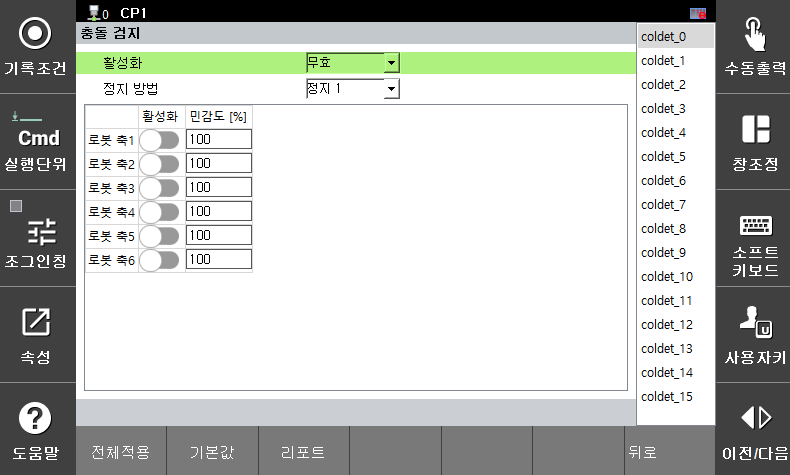

# 3.3.2.5 충돌 검지

로봇에 가해지는 외력이 허용치를 초과하는 경우 충돌로 인식합니다. 각 축의 민감도를 조절할 수 있으며, 민감도가 높을수록 작은 외력에도 충돌로 인식합니다. 모니터링 위반 시에는 안전 정지(정지 0, 정지 1, 정지 2)가 즉시 활성화됩니다.

`[시스템 > 10: 안전 시스템 > 2: 파라미터 설정 > 1: 로봇 제한 > 5: 충돌 검지]` 메뉴에서 파라미터 값을 설정할 수 있습니다.

</img>
<em>
충돌 검지 설정 화면
</em>

| **파라미터** |          **설명**                                                  |  **기본 설정값** |
| :------: | :----------------------------------------------------------------: | :---------: |
| 활성화 | 
기능 활성화 여부

(무효 / 유효 / 안전 입출력)
 |  무효  |
| 정지 방법 |   
기능 위반시 정지 방법

(정지 0 / 정지 1 / 정지 2 / 무정지)
  | 정지 1 |
| 조인트 활성화 |   
각 관절의 활성화 여부

(활성화 / 비활성화)
  | 비활성화 |
| 
민감도

[%]
 |   
각 관절의 검지 민감도

(1 ~ 200)
  | 100 |


* 운동 에너지에 비례하여 속도가 높고 가반 하중이 큰 경우 로봇의 충격량이 커질 수 있으므로 로봇이 외부의 물체와 충돌하는 경우 상당한 수준의 충격이 발생할 수 있습니다. 협동 공간에서는 안전한 속도와 가반 하중을 유지하여 운전하십시오.
* 툴 정보 및 부가 중량을 실제와 다르게 설정하면 오감지가 발생할 수 있습니다. 충돌 검지 기능 사용 전 각 정보를 확인해주십시오.

