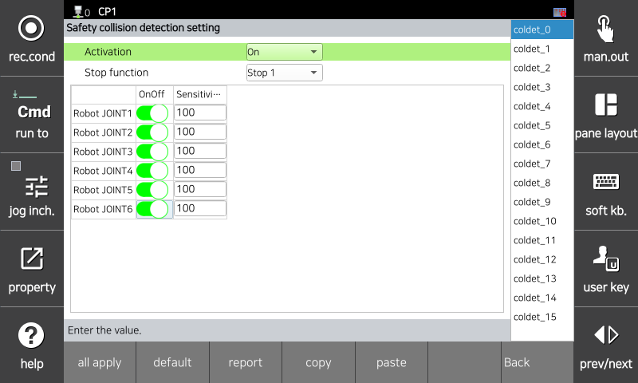

# 3.3.2.5 Collision Detection

When the external force applied to the robot exceeds the allowable value, it is recognized as a collision. You can adjust the sensitivity of each axis, and the higher the sensitivity, the more even a small external force is recognized as a collision. When the monitoring is violated, a safety stop (Stop 0, Stop 1, and Stop 2) is immediately activated.

`[System > 10: Safety System > 2: Parameter setup > 1: Robot restriction > 5: Collision detection]` menu allows you to set the parameter values.

</img>
<em>
Collision detection parameter setting screen
</em>

| **Parameter** |                                  **Description**                                  |  **Default Setting** |
| :------: | :----------------------------------------------------------------: | :---------: |
| Activation | 
Function activation status

(OFF/ON/Safety Input)
 |   OFF  |
| Stop function |   
Stop method when the function is violated

(Stop 0, Stop 1, Stop 2, Non-stop)
  | Stop 1 |
| Joint ON/OFF |   
Activation status of each joint

(ON/OFF)
  |  OFF |
| Sensitivity |   
Detection sensitivity for each joint

(0 ~ 200(%))
  |  100 |


<strong>[Caution]</strong> Since the robot's impact force can increase in proportion to kinetic energy when the speed is high and the payload is large, considerable impact may occur if the robot collides with an external object. In the collaborative space, operate while maintaining the safe speed and payload.
<strong>[Caution]</strong> False detection may occur if the tool information and additional weight are set differently from actual values. Check each information before using the collision detection function.

