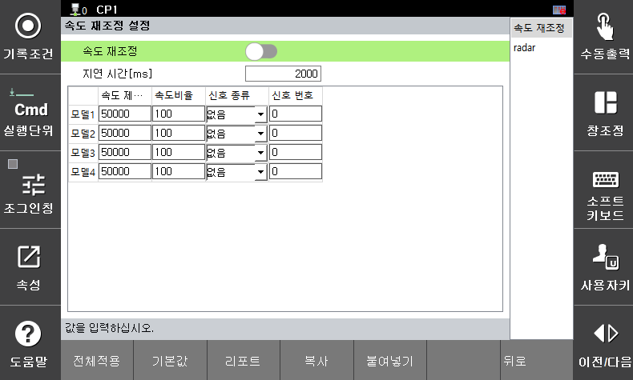

# 3.3.2.6 RePlan 설정

RePlan은 외부 안전 센서로부터 입력 받은 신호를 기반으로 로봇의 속도를 조절하는 기능입니다. 입력신호에 해당하는 감속비율로 로봇의 운전속도가 변경되고, 지연시간 이후에 해당하는 속도로 TCP 속도를 감시합니다. 

지연시간이 충분하지 않거나, 로봇의 감속이 충분히 이루어지지 않아 TCP 속도 제한값을 위반하게 되면 안전 정지(정지 0, 정지 1, 정지 2)가 즉시 활성화됩니다.

**\[시스템 > 8: 안전 시스템 > 2: 파라미터 설정 > 1: 로봇 제한 > 6: 속도 재조정]** 메뉴에서 파라미터 값을 설정할 수 있습니다.

</img>
<em>
속도 재조정 설정 화면
</em>

|  **파라미터** |                       **설명**                       |  **기본 설정값**  |
| :-------: | :------------------------------------------------: | :----------: |
| RePlan |   
입력신호에 따른 속도 조절 기능 사용 여부

(활성화 / 비활성화)
  | 비활성화 |
| 
지연 시간

[ms]
 |   
속도 재조정으로 속도 변경시 지연시간 이후에 변경된 속도 제한값으로 감시함  

(0 ~ 1000)
  | 2000 |
| 
속도 제한값

[mm/s]
 |   
속도 재조정 이후 TCP 속도 제한값

(0 ~ 50000)
  | 50000 |
| 
속도 비율

[%]
 |   
속도 재조정 시 사용할 감속 비율

(0 ~ 100)
  | 100 |
| 
입력 신호

[종류, 번호]
 |   
속도 재조정을 위한 입력 신호

( [없음, -] / [안전 입력, 1~8] / [PROFIsafe, 1~64] )
  | 0 |


* 속도 한계 구성 시에는 반드시 정지 시간을 고려하고 커버를 덮어 충돌 및 부상을 예방하십시오.
* 운동 에너지에 비례하여 속도가 높고 가반 하중이 큰 경우 로봇의 충격량이 커질 수 있으므로 로봇이 외부의 물체와 충돌하는 경우 상당한 수준의 충격이 발생할 수 있습니다. 협동 공간에서는 안전한 속도와 가반 하중을 유지하여 운전하십시오.

ㅋ