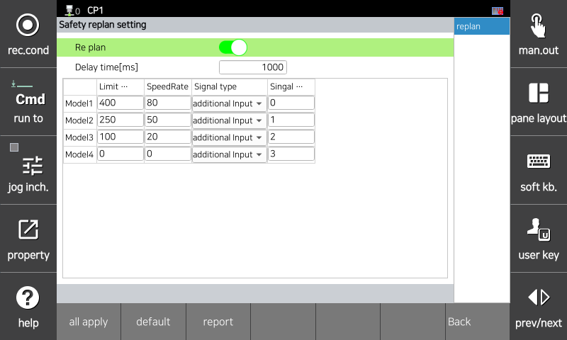

# 3.3.2.6 Re plan Setting

Re plan is a function that adjusts the robot's speed based on signals received from external safety sensors. The robot's operating speed is adjusted to the deceleration rate corresponding to the input signal, and the TCP speed is monitored at the corresponding speed after a delay time.

If the delay time is insufficient or the robot decelerates insufficiently, resulting in a violation of the TCP speed limit, a safety stop (Stop 0, Stop 1, Stop 2) is immediately activated.

You can set the parameter values   in the `[System > 10: Safety System > 2: Parameter setup > 1: Robot restriction > 6: Re plan]` menu.

</img>
<em>
Re plan settings screen
</em>

|  **Parameter** |                       **Description**                       |  **Default Setting**  |
| :-------: | :------------------------------------------------: | :----------: |
| Re plan | 
Whether to use the speed control function according to the input signal

(Enable / Disable)
 | Disable |
| 
Delay time

[ms]
 | 
When changing the speed with Re plan, monitor the changed speed limit value after the delay time 

(0 ~ 2000)
 | 2000 |
| 
Speed limit value

[mm/s]
 | 
TCP speed limit value after Re plan

(0 ~ 50000)
 | 50000 |
| 
Speed ratio

[%]
 | 
Deceleration ratio to use when Re plan

(0 ~ 100)
 | 100 |
| 
Input signal

[Type, Number]
 | 
Input signal for Re plan

( [None, -] / [default input, 3] / [additional input, 0~7] / [safety input, 0~63])
 | 0 |


<strong>[Caution]</strong> When configuring speed limits, always consider stopping time and cover the robot to prevent collisions and injuries.
<strong>[Caution]</strong> High speeds and large payloads, in proportion to the robot's kinetic energy, can increase the robot's impact force. Therefore, a significant impact can occur if the robot collides with an external object. Maintain a safe speed and payload in collaborative spaces.

