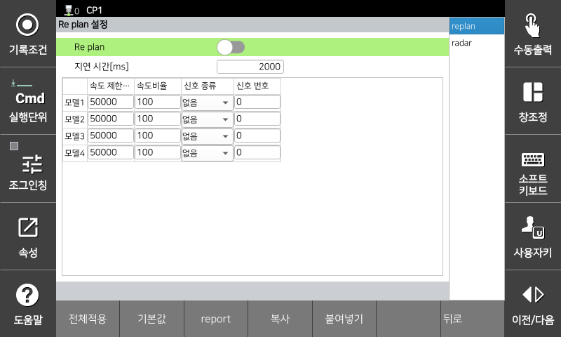

# 3.3.2.6 Re Plan-Funktion

Replan ist eine Funktion, die die Robotergeschwindigkeit anhand von Signalen externer Sicherheitssensoren anpasst. Die Betriebsgeschwindigkeit des Roboters wird entsprechend der Verzögerungsrate des Eingangssignals angepasst, und die TCP-Geschwindigkeit wird nach einer Verzögerungszeit bei der entsprechenden Geschwindigkeit überwacht.

Reicht die Verzögerungszeit nicht aus oder verzögert der Roboter nicht ausreichend, sodass die TCP-Geschwindigkeitsgrenze überschritten wird, wird sofort ein Sicherheitsstopp (Stop 0, Stopp 1, Stopp 2) ausgelöst.

Die Parameterwerte können Sie im Menü **\[System > 8: Sicherheitssystem > 2: Parametereinstellung > 1: Robotergrenzen > 6: Neuplanung]** einstellen.

</img>
<em>
Bildschirm „Einstellungen Re plan“.
</em>

|  **Parameter** |                       **Beschreibung**                       |  **Standardeinstellung**  |
| :-------: | :------------------------------------------------: | :----------: |
| Replan | 
Geschwindigkeitsregelung abhängig vom Eingangssignal verwenden

(Aktivieren / Deaktivieren)
 | Deaktivieren |
| 
Verzögerungszeit

[ms]
 | 
Geschwindigkeitsbegrenzungswert nach Geschwindigkeitsänderung mit Replan überwachen

(0 ~ 1000)
 | 2000 |
| 
Geschwindigkeitsbegrenzungswert

[mm/s]
 | 
TCP-Geschwindigkeitsbegrenzungswert nach Replan

(0 ~ 50000)
 | 50000 |
| 
Geschwindigkeitsverhältnis

[%]
 | 
Verzögerungsverhältnis bei Replan

(0 ~ 100)
 | 100 |
| 
Eingangssignal

[Typ, Nummer]
 | 
Eingangssignal für Re plan

( [Keine, -] / [Sicherheitseingang, 1~8] / [PROFIsafe, 1~64] )
 | 0 |


* Bei der Konfiguration von Geschwindigkeitsbegrenzungen ist stets die Bremszeit zu berücksichtigen und der Roboter abzudecken, um Kollisionen und Verletzungen zu vermeiden.
* Hohe Geschwindigkeiten und große Nutzlasten können, proportional zur kinetischen Energie des Roboters, dessen Aufprallkraft erhöhen. Daher kann es bei einer Kollision mit einem externen Objekt zu einem erheblichen Aufprall kommen. In kollaborativen Umgebungen ist daher eine sichere Geschwindigkeit und Nutzlast einzuhalten.

