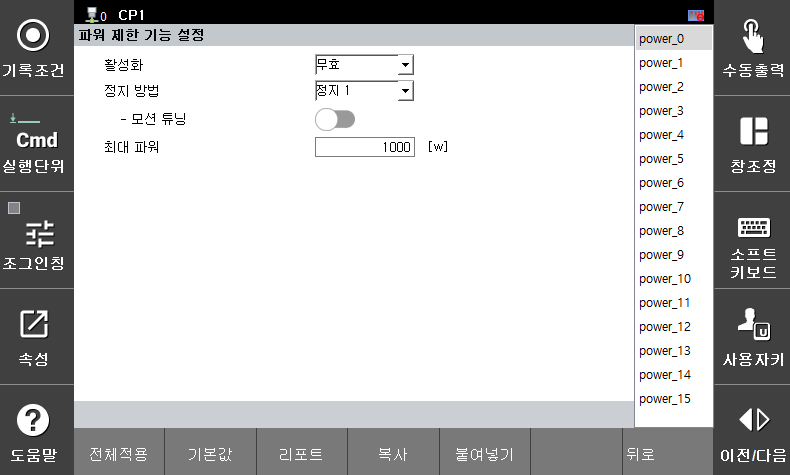

# 3.3.2.7 Power Setting

This function monitors whether the force generated by the robot exceeds the allowable limit. If a monitoring violation occurs, a safety stop (Stop 0, Stop 1, or Stop 2) is immediately activated.

You can set the parameter values ​​in the **\[System > 8: Safety System > 2: Parameter Settings > 1: Robot Limits > 7: Power]** menu.

</img>
<em>
Power settings screen
</em>

| **Parameter** | 　　　　　　　　　**Description**                                                  |  **Default Setting** |
| :------: | :----------------------------------------------------------------: | :---------: |
| Activate | 
Whether the function is activated

(Invalid / Valid / Safe I/O)
 | Invalid |
| Stop method | 
Stop method in case of function violation

(Stop 0 / Stop 1 / Stop 2 / No stop)
 | Stop 1 |
| Motion tuning | 
Tuning to a motion that does not exceed the robot's power limit

(Active / Disable)
 | Disable |
| 
Maximum power

[w]
 | 
Robot's power limit

(80 ~ 1000)
 | 1000 |


* High speeds and large payloads, proportional to the robot's kinetic energy, can increase the robot's impact force. Therefore, a collision with an external object can result in significant impact. In collaborative spaces, maintain a safe speed and payload.
* Setting tool information and additional weights differently from actual values ​​may result in false detection. Please check the information before using this feature.

