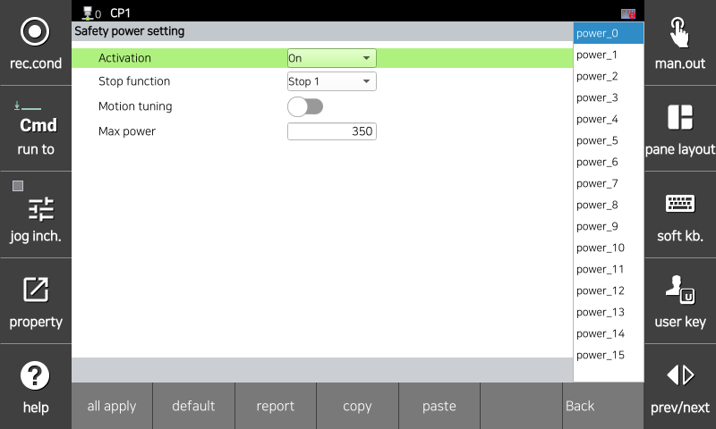

# 3.3.2.7 电源设置

此功能监控机器人产生的力量是否超过允许的限制。如果发生监控违规，将立即激活安全停止（停止 0、停止 1 或停止 2）。

您可以在 `[System > 10: Safety System > 2: Parameter setup > 1: Robot restriction > 7: Power]` 菜单中设置参数值。

</img>
<em>
电源设置屏幕
</em>

| **参数** |          **描述**                                                  |  **默认设置** |
| :------: | :----------------------------------------------------------------: | :---------: |
| 启用 | 
功能是否被激活

(OFF / ON / Safety I/O)
 | OFF |
| 停止功能 | 
发生功能违规时的停止方法

(停止 0 / 停止 1 / 停止 2 / 无停止)
 | 停止 1 |
| 动作调节 | 
调节为不超过机器人功率限制的动作

(激活 / 禁用)
 | 禁用 |
| 
最大功率

[w]
 | 
机器人的功率限制

(80 ~ 50000)
 | 1000 |


<strong>[警告]</strong> 高速和大负载，与机器人的动能成比例，会增加机器人的冲击力。因此，与外部物体的碰撞可能会导致显著的冲击。在协作空间中，请保持安全的速度和负载。
<strong>[警告]</strong> 将工具信息和附加重量与实际值不同的设置可能会导致错误检测。使用此功能前请检查信息。
