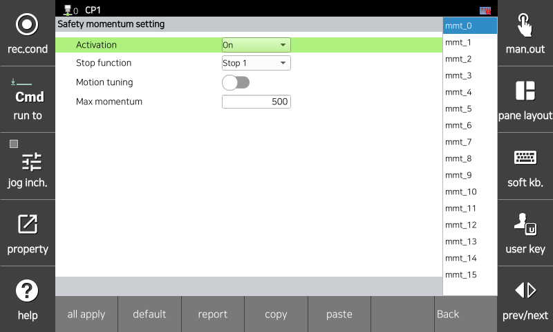

# 3.3.2.8 动量设置

此功能监控机器人产生的动量是否超过允许的限制。如果发生监控违规，将立即激活安全停止（停止 0、停止 1 或停止 2）。

您可以在 `[System > 10: Safety System > 2: Parameter setup > 1: Robot restriction > 8: Momentum]` 菜单中设置参数值。

</img>
<em>
动量设置屏幕
</em>

| **参数** |          **描述**                                                  |  **默认设置** |
| :------: | :----------------------------------------------------------------: | :---------: |
| 激活 | 
功能是否被激活

(OFF / ON / Safety I/O)
 | OFF |
| 停止功能 | 
功能违规时的停止方法

(停止 0 / 停止 1 / 停止 2 / 不停止)
 | 停止 1 |
| 动作调节 | 
调节使动作不超过机器人的动量限制

(启用 / 禁用)
 | 禁用 |
| 
最大动量

[kg m/s]
 | 
机器人的动量限制

(5 ~ 50000)
 | 1000 |


<strong>[注意]</strong> 高速度和大负载与机器人的动能成正比，可能会增加机器人的冲击力。因此，与外部物体的碰撞可能会造成重大冲击。在协作空间中，保持安全的速度和负载。
<strong>[注意]</strong> 设置工具信息和附加重量与实际值不同可能会导致错误检测。在使用此功能之前，请检查信息。
