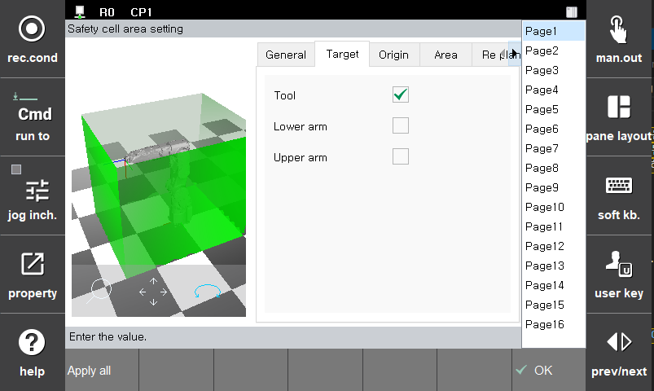
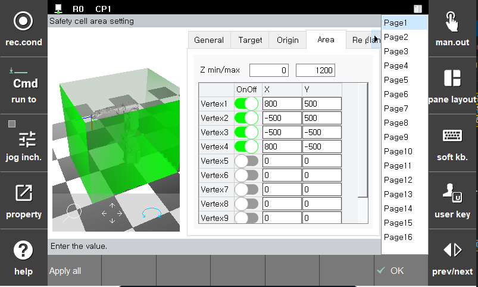

# 3.3.2.1 안전 영역 설정

안전 영역은 툴 및 로봇 링크 영역을 모니터링하기 위한 작업 공간 또는 보호 공간입니다. 작업 공간은 모니터링 대상이 자유롭게 움직일 수 있지만 떠날 수는 없는 제한된 공간입니다. 이와 달리, 보호 공간은 모니터링 대상이 진입하면 움직일 수 없는 제한된 공간입니다. 로봇이 설정한 작업 공간을 벗어나거나, 보호 공간을 침범할 경우 안전 정지(정지0, 정지1, 정지2)가 활성화됩니다.

안전 영역은 로봇 좌표계를 기준으로 각 꼭지점의 위치와 높이를 설정하여 공간을 구성합니다. 꼭지점은 최대 10 개까지 추가할 수 있습니다. 안전 공간은 파라미터 설정 또는 안전 I/O 신호에 의해 활성화됩니다.

안전 영역은 **\[시스템 > 4: 응용 파라미터 > 18: SafeSpace2.0 > 파라미터 설정 > 레이아웃 제한 > 셀 영역]** 메뉴의 각 탭에서 파라미터값을 설정할 수 있습니다.

*   **General** 

|  **파라미터** |                       **설명**                       |  **기본 설정값**  |
| :-------: | :------------------------------------------------: | :----------: |
| Activation | 
기능 활성화 여부

(Off/On/Safety Input)
 |   Off  |
| Stop function |   
기능 위반시 정지 방법

(Stop0, Stop1, Stop2, Non-stop)
  | Stop 1 |
| Type |  
안전영역의 종류

(작업영역/보호영역)
  | 작업 영역 |

*   **Target** 

|  **파라미터** |                       **설명**                       |  **기본 설정값**  |
| :-------: | :------------------------------------------------: | :----------: |
| Tool | 
툴 모델링 감시

(Off/On/Safety Input)
 |   Off  |
| Lower arm |   
로봇 2축 모델링 감시

(Off/On)
  | Off |
| Upper arm |  
로봇 3축 모델링 감시

(Off/On)
  | Off |

*   **Area** 

|  **파라미터** |                       **설명**                       |  **기본 설정값**  |
| :-------: | :------------------------------------------------: | :----------: |
| Z min/max | 
로봇좌표계 기준 안전 영역의 높이

(-5000.0 ~ 5000.0 mm)
 |   0  |
| Vertex OnnOff |   
안전 영역의 꼭지점 활성화 여부

(Off/On)
  | Off |
| X |  
로봇좌표계 기준 꼭지점의 X방향 위치

(-5000.0 ~ 5000.0 mm)
  | 0 |
| Y |  
로봇좌표계 기준 꼭지점의 Y방향 위치

(-5000.0 ~ 5000.0 mm)
  | 0 |


**\[주의]**: 안전기능은 설정한 영역을 기반으로 감시합니다. 설정한 영역이 정지거리를 감안하여 설정해야 하며, 구동 전 반드시 검증을 수행해야합니다.
