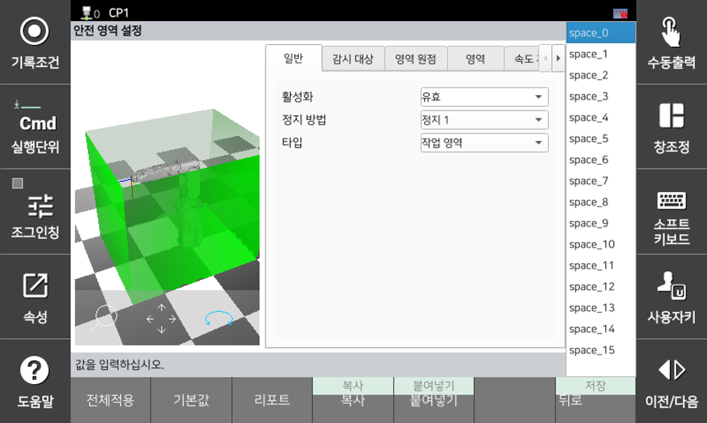
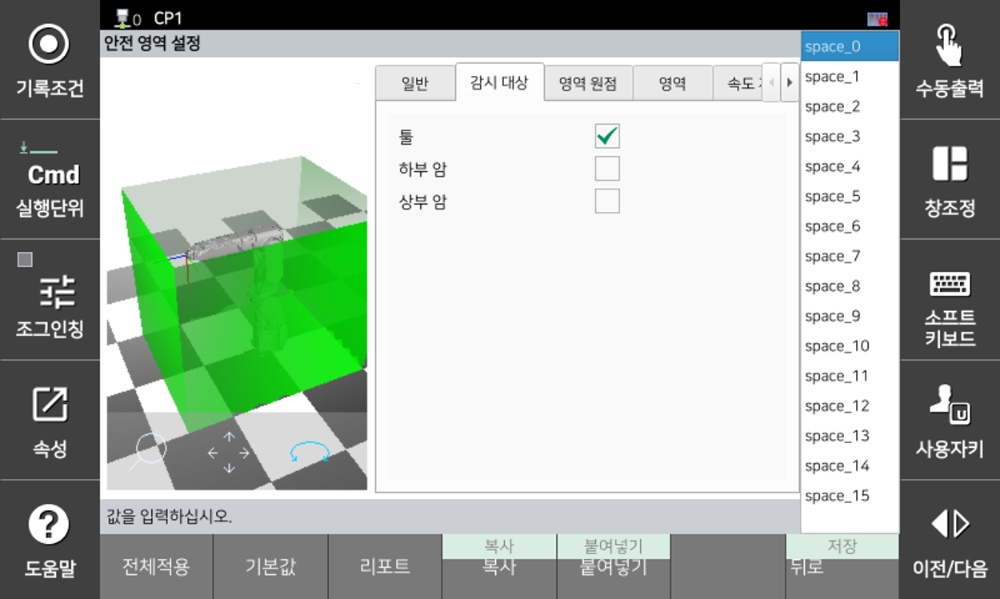

# 3.3.2.1 安全区域设置

安全区域是用于监控工具及机器人连杆区域的工作空间或保护空间。工作空间是监控对象可以自由移动但不能离开的受限空间。与此不同，保护空间是监控对象进入后不能移动的受限空间。当机器人离开已设定的工作空间或侵入保护空间时，安全停止（停止0、停止1、停止2）将被激活。

安全区域以机器人坐标系为基准，通过设置各顶点的位置和高度来构成空间。最多可添加10个顶点。安全空间由参数设置或安全I/O信号激活。

안전 영역은 **可以在\[系统 > 4: 应用参数 > 18: SafeSpace2.0 > 参数设置 > 布局限制 > 单元区域]菜单的各选项卡中设置安全区域的参数值。** 메뉴의 각 탭에서 파라미터값을 설정할 수 있습니다.

* **General**

|  **|  参数 |                       说明                       |  默认设定值  |** |                       **|  参数 |                       说明                       |  默认设定值  |**                       |  **|  参数 |                       说明                       |  默认设定值  |**  |
| :-------: | :------------------------------------------------: | :----------: |
| Activation | 
功能激活与否

(Off/On/Safety Input)
 |   Off  |
| Stop function |   
功能违规时的停止方法

(Stop0, Stop1, Stop2, Non-stop)
  | Stop 1 |
| Type |  
安全区域的类型

（工作区域/保护区域）
  | 工作区域 |

* **Target**

|  **|  参数 |                       说明                       |  默认设定值  |** |                       **|  参数 |                       说明                       |  默认设定值  |**                       |  **|  参数 |                       说明                       |  默认设定值  |**  |
| :-------: | :------------------------------------------------: | :----------: |
| Tool | 
工具建模监控

(Off/On/Safety Input)
 |   Off  |
| Lower arm |   
机器人2轴建模监控

(Off/On)
  | Off |
| Upper arm |  
机器人3轴建模监控

(Off/On)
  | Off |

* **Area**

|  **|  参数 |                       说明                       |  默认设定值  |** |                       **|  参数 |                       说明                       |  默认设定值  |**                       |  **|  参数 |                       说明                       |  默认设定值  |**  |
| :-------: | :------------------------------------------------: | :----------: |
| Z min/max | 
以机器人坐标系为基准的安全区域高度

(-5000.0 ~ 5000.0 mm)
 |   0  |
| Vertex OnnOff |   
安全区域顶点的激活与否

(Off/On)
  | Off |
| X |  
以机器人坐标系为基准的顶点X方向位置

(-5000.0 ~ 5000.0 mm)
  | 0 |
| Y |  
以机器人坐标系为基准的顶点Y方向位置

(-5000.0 ~ 5000.0 mm)
  | 0 |


*\[注意]**：安全功能基于已设定的区域进行监控。设定区域时应考虑停止距离，驱动前必须进行验证。
