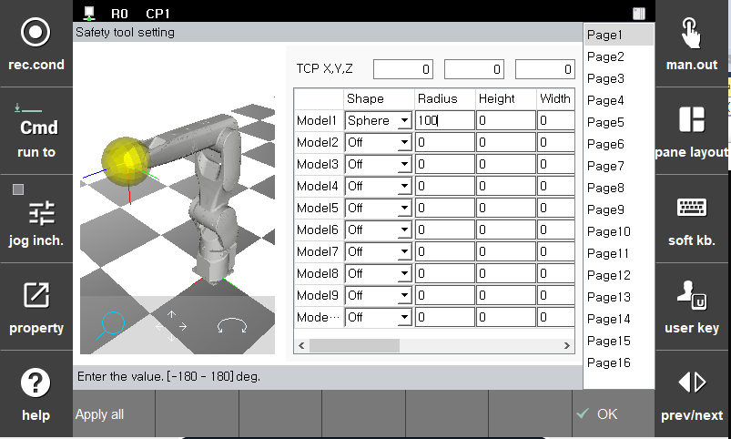

# 3.3.2.2 안전 툴 모델링

안전 영역 모니터링에 사용하는 툴로 모델링한 구의 보호 영역 침범 및 작업 영역 이탈 여부를 감시합니다. 안전 툴은 최대 16 개를 설정할 수 있으며 최대 10 개의 모델로 모델링할 수 있습니다.

안전 툴은 티치 펜던트에서 설정한 툴 번호로 활성화되므로 \[설정 > 3: 로봇 파라미터 > 1: 툴 데이터] 메뉴에서 설정한 툴 데이터를 기반으로 안전 툴을 모델링해야 합니다. 툴 데이터 설정 화면 상단의 TCP 위치 정보를 참고하십시오.

안전 툴 모델링에 사용되는 모델은 총 3가지로 구, 캡슐, 플레이트 형태가 있습니다. 각 모델은 중심과 반지름으로 구성됩니다. 모델링의 중심 위치와 반경은 로봇 플랜지 좌표계(Xf, Yf, Zf)를 기준으로 설정하고 반지름은 툴의 크기 및 최대 TCP 속도에서의 정지 거리를 포함하여 설정합니다.

**\[설정 > 4: 응용 파라미터 > 21: 협동로봇 설정 > 1: 안전 기능 > 2: 안전 레이아웃]** 메뉴의 **\[툴]** 버튼을 터치하면 파라미터 값을 설정할 수 있습니다.

|  **파라미터** |                       **설명**                       |  **기본 설정값**  |
| :-------: | :------------------------------------------------: | :----------: |
| TCP X,Y,Z | 
플랜지 좌표계에서 TCP 위치(읽기 전용)- 툴 정보에서 설정
 |   0  |
| Shape |   
툴 모델링 형태

(Off/sphere/capsule/R-plate)
  | Off |
| Radius |  
반지름

(0.0 ~ 1000.0 mm)
  | 0 |
| Height |  
R-plate의 높이

(0.0 ~ 1000.0 mm)
  | 0 |
| Width |  
R-plate의 폭

(0.0 ~ 1000.0 mm)
  | 0 |
| X |  
X방향 모델 중심 위치

(-1000.0 ~ 1000.0 mm)
  | 0 |
| Y |  
Y방향 모델 중심 위치

(-1000.0 ~ 1000.0 mm)
  | 0 |
| Z |  
Z방향 모델 중심 위치

(-1000.0 ~ 1000.0 mm)
  | 0 |


**\[주의]**

* 툴 데이터 변경 시 반드시 안전 툴 모델링에서 설정한 파라미터가 정확한지 다시 확인하십시오. 동일한 툴의 툴 데이터 번호와 안전 툴 모델링 번호는 일치해야 합니다.
* 로봇 레이아웃 설정의 정의는 로봇 2축과 3축에만 해당되므로 안전 영역을 설정하더라도 로봇의 다른 부분이 이 영역을 침범할 수 있습니다.

