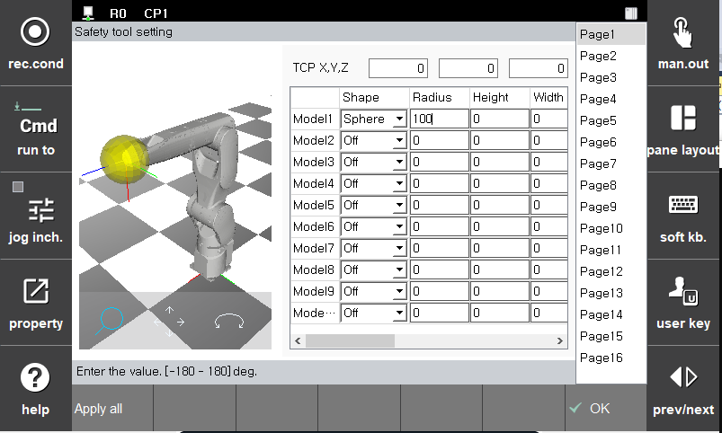

# 3.3.2.2 安全工具建模

通过将用于安全区域监控的工具建模为球体，监控其是否侵入保护区域或超出作业区域。最多可设置16个安全工具，最多可用10个模型建模。

安全工具通过示教器中设定的工具编号激活，因此必须基于\[设置 > 3: 机器人参数 > 1: 工具数据]菜单中设置的工具数据进行安全工具建模。请参考工具数据设置界面上方的TCP位置信息。

用于安全工具建模的模型共有3种：球体、胶囊体和板状体。各模型由中心与半径组成。建模的中心位置和半径以机器人法兰坐标系（Xf, Yf, Zf）为基准设置，半径应包括工具尺寸及最大TCP速度下的停止距离。

*\[系统 > 4: 应用参数 > 18: SafeSpace2.0 > 参数设置 > 布局限制 > 工具]**菜单中，可以设置参数值。

|  **|  参数 |                       说明                       |  默认设定值  |** |                       **|  参数 |                       说明                       |  默认设定值  |**                       |  **|  参数 |                       说明                       |  默认设定值  |**  |
| :-------: | :------------------------------------------------: | :----------: |
| TCP X,Y,Z | 
法兰坐标系中的TCP位置（只读）- 在工具信息中设置
 |   0  |
| Shape |   
工具建模形态

(Off/sphere/capsule/R-plate)
  | Off |
| Radius |  
半径

(0.0 ~ 1000.0 mm)
  | 0 |
| Height |  
R-plate的高度

(0.0 ~ 1000.0 mm)
  | 0 |
| Width |  
R-plate的宽度

(0.0 ~ 1000.0 mm)
  | 0 |
| X |  
X方向模型中心位置

(-1000.0 ~ 1000.0 mm)
  | 0 |
| Y |  
Y方向模型中心位置

(-1000.0 ~ 1000.0 mm)
  | 0 |
| Z |  
Z方向模型中心位置

(-1000.0 ~ 1000.0 mm)
  | 0 |


*\[注意]**

* 更改工具数据时，请务必重新确认安全工具建模中所设置的参数是否准确。相同工具的工具数据编号与安全工具建模编号必须一致。
* 机器人布局设置的定义仅适用于机器人2轴和3轴，因此即使设置了安全区域，机器人的其他部分也可能侵入该区域。

