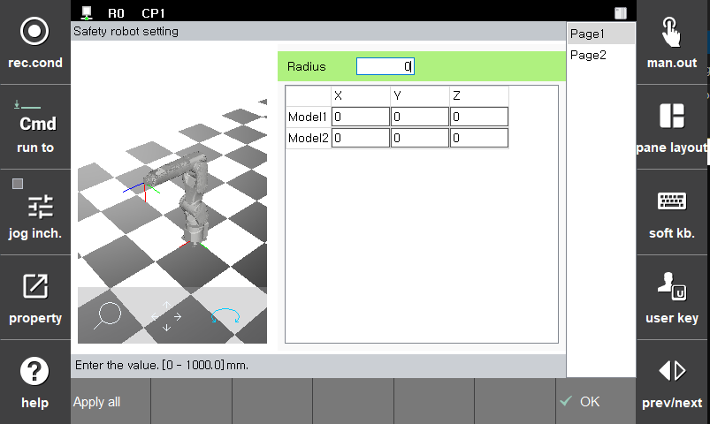

# 3.3.2.3 안전 로봇 모델링

안전 공간 모니터링에 사용하는 로봇 모델입니다. 안전 로봇 모델링은 2축과 3축에 적용할 수 있으며 모두 캡슐로 모델링합니다.

안전 로봇 모델링에 사용되는 캡슐은 양 끝의 구 중심과 반지름으로 구성됩니다. 모델링의 구 중심은 로봇 2축/3축 중심 위치이고 반지름은 현재 링크의 크기 및 최대 TCP 속도에서의 정지 거리를 포함할 수 있을 만큼 커야 합니다.

**\[설정 > 4: 응용 파라미터 > 21: 협동로봇 설정 > 1: 안전 기능 > 2: 안전 레이아웃]** 메뉴의 **\[로봇]** 버튼을 터치하면 파라미터 값을 설정할 수 있습니다.

| **파라미터** | 　　　　　　　　　**설명**                                     | **기본 설정값** |
| :------: | --------------------------------------------------- | :--------: |
|    반경    | 구체의 반지름(0 ~ 1000.0 (mm))                           |    0 mm    |
|   Model1  X,Y,Z | 구체의 반지름(-1000.0 ~ 1000.0 (mm))                           |    0 mm    |
|   Model2 X,Y,Z | 구체의 반지름(-1000.0 ~ 1000.0 (mm))                           |    0 mm    |
