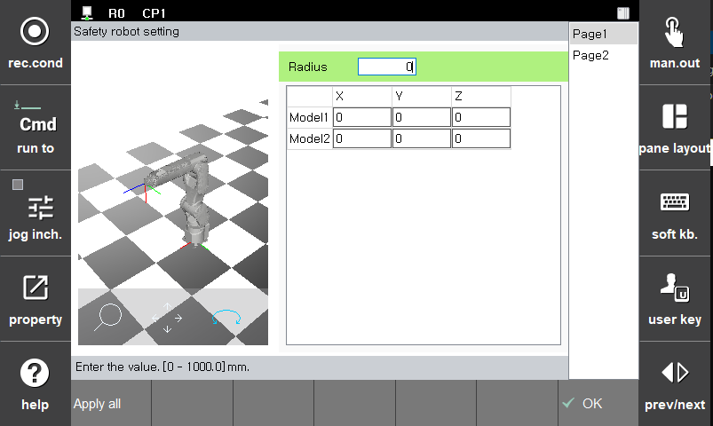

# 3.3.2.3 安全机器人建模

用于安全空间监控的机器人模型。安全机器人建模可应用于2轴和3轴，全部以胶囊体形式建模。

用于安全机器人建模的胶囊由两端的球体中心和半径组成。建模的球体中心是机器人2轴/3轴中心位置，半径必须足够大以包括当前连杆的尺寸及最大TCP速度下的停止距离。

*\[系统 > 4: 应用参数 > 18: SafeSpace2.0 > 参数设置 > 布局限制 > 机器人]**菜单中，可以设置参数值。

| **|  参数 | 　　　　　　　　　说明                                     |  默认设定值  |** | 　　　　　　　　　**|  参数 | 　　　　　　　　　说明                                     |  默认设定值  |**                                     | **|  参数 | 　　　　　　　　　说明                                     |  默认设定值  |** |
| :------: | --------------------------------------------------- | :--------: |
|    半径    | 球体半径（0 ~ 1000.0 (mm)）                         |    0 mm    |
|   Model1  X,Y,Z | 球体的半径（-1000.0 ~ 1000.0 (mm)）                           |    0 mm    |
|   Model2 X,Y,Z | 球体的半径（-1000.0 ~ 1000.0 (mm)）                           |    0 mm    |


*\[注意]**

* 机器人布局设置的定义仅适用于机器人2轴和3轴，因此即使设置了安全区域，机器人的其他部分也可能侵入该区域。
