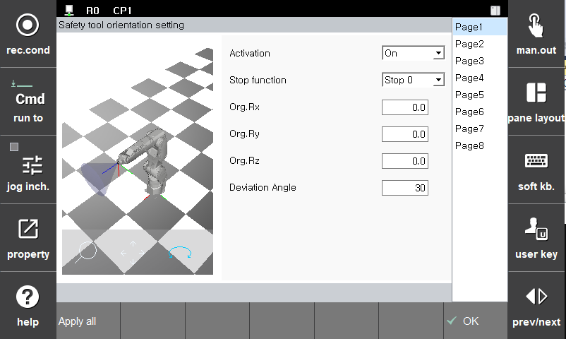

# 3.3.2.4 TCP-Orientierungsüberwachung

Um die TCP-Orientierungsüberwachungsfunktion zu verwenden, können Sie einen Überwachungskegel einrichten, indem Sie den Drehwinkel und den Abweichungswinkel für die Erzeugung des Referenzvektors festlegen.

Der Z-Richtungsvektor des Roboterkoordinatensystems (!\) wird um den eingestellten Winkel gedreht, um den Referenzvektor (!\) festzulegen, und ein Kegel (!\) bestehend aus Generatricen mit einem Abweichungswinkel (!\) davon kann modelliert werden. Der Scheitelpunkt (!\) eines solchen Kegels befindet sich am TCP, und ein Verstoß gegen die TCP- Orientierungseinschränkungsfunktion tritt auf, wenn der TCP-Z-Richtungsvektor (!\) den Überwachungskegel überschreitet.

Über das Menü \[System > 4: Anwendungsparameter > 18: SafeSpace2.0 > Parametereinstellungen > Layoutbeschränkung > TCP-Orientierung]* können Sie die Parameterwerte festlegen.

|  **|  Parameter |                       Beschreibung                       |  Standardeinstellung  |** |                       **|  Parameter |                       Beschreibung                       |  Standardeinstellung  |**                       |  **|  Parameter |                       Beschreibung                       |  Standardeinstellung  |**  |
| :-------: | :------------------------------------------------: | :----------: |
| Activation | 
Funktionsaktivierungsstatus

(Off/On/Safety Input)
 |   Off  |
| Stop function |   
Stoppmethode bei Funktionsverletzung

(Stop0, Stop1, Stop2, Non-stop)
  | Stop 1 |
| Rx |   
Drehwinkel des Referenzvektors basierend auf der X-Richtung

(-180.0 ~ 180.0 (deg))
  |  0.0 |
| Ry |   
Drehwinkel des Referenzvektors basierend auf der Y-Richtung

(-180.0 ~ 180.0 (deg))
  |  0.0 |
| Rz |   
Drehwinkel des Referenzvektors basierend auf der Z-Richtung

(-180.0 ~ 180.0 (deg))
  |  0.0 |
| Abweichungswinkel |   
TCP-Orientierungsgrenzwert

(-180.0 ~ 180.0 (deg))
  |  0.0 |


*\[Achtung]**

* Achten Sie beim Ändern von Werkzeugdaten darauf, erneut zu überprüfen, ob die in der Sicherheitswerkzeugmodellierung eingestellten Parameter korrekt sind. Die Werkzeugdatennummer und die Sicherheitswerkzeugmodellierungsnummer desselben Werkzeugs müssen übereinstimmen.

