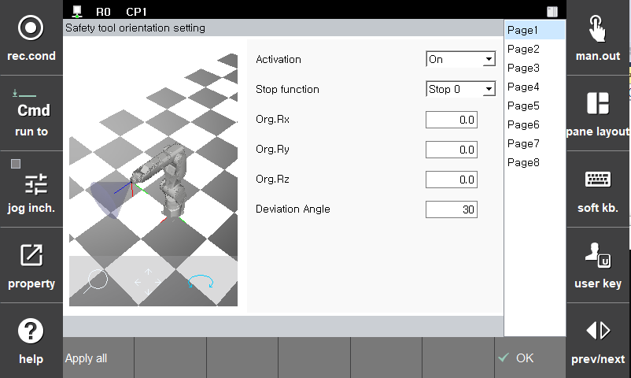

# 3.3.2.4 TCP 방향 감시

TCP 방향 감시 기능을 사용하기 위해, 기준 벡터 생성을 위한 회전 각도 및 편차 각도를 설정하여 모니터링용 원뿔을 설정할 수 있습니다.

로봇 좌표계()의 Z방향 벡터를 기준으로 설정된 각도로 회전시켜 기준 벡터()를 설정하여 이로부터 편차 각도()만큼 벌어져 있는 모선들로 이루어지는 원뿔()을 모델링할 수 있습니다. 이와 같은 원뿔의 꼭지점()은 TCP에 위치하며 TCP의 Z방향 벡터()가 모니터링 원뿔을 넘어가면 TCP 방향 제한 기능 위반 에러가 발생합니다.

**\[시스템 > 4: 응용 파라미터 > 18: SafeSpace2.0 > 파라미터 설정 > 레이아웃 제한 > TCP 방향]** 메뉴에서 파라미터 값을 설정할 수 있습니다. 

|  **파라미터** |                       **설명**                       |  **기본 설정값**  |
| :-------: | :------------------------------------------------: | :----------: |
| Activation | 
기능 활성화 여부

(Off/On/Safety Input)
 |   Off  |
| Stop function |   
기능 위반시 정지 방법

(Stop0, Stop1, Stop2, Non-stop)
  | Stop 1 |
| Rx |   
X방향 기준 기준 벡터의 회전량

(-180.0 ~ 180.0 (deg))
  |  0.0 |
| Ry |   
Y방향 기준 기준 벡터의 회전량

(-180.0 ~ 180.0 (deg))
  |  0.0 |
| Rz |   
Z방향 기준 기준 벡터의 회전량

(-180.0 ~ 180.0 (deg))
  |  0.0 |
| 편차 각도 |   
TCP 방향 제한값

(-180.0 ~ 180.0 (deg))
  |  0.0 |


**\[주의]**

* 툴 데이터 변경 시 반드시 안전 툴 모델링에서 설정한 파라미터가 정확한지 다시 확인하십시오. 동일한 툴의 툴 데이터 번호와 안전 툴 모델링 번호는 일치해야 합니다.
* 로봇 레이아웃 설정의 정의는 엘보우에만 해당되므로 안전 영역을 설정하더라도 로봇의 다른 부분이 이 영역을 침범할 수 있습니다.

