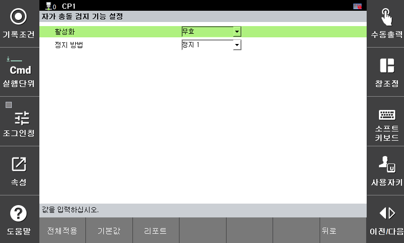

# 3.3.2.5 자가 충돌 검지

**\[시스템 > 8: 안전 시스템 > 2: 파라미터 설정 > 2: 영역 제한 > 5: 자가 충돌 검지]** 메뉴에서 로봇의 자가 충돌 검지 기능을 사용하기 위한 파라미터를 설정할 수 있습니다. 

</img>
<em>
자가 충돌 검지 기능 파라미터 설정 화면
</em>

|  **파라미터** |                       **설명**                       |  **기본 설정값**  |
| :-------: | :------------------------------------------------: | :----------: |
| 활성화 | 
기능 활성화 여부

(무효 / 유효 / 안전 입출력)
 |   무효  |
| 정지 방법 |   
기능 위반시 정지 방법

(정지 0 / 정지 1 / 정지 2 / 무정지)
  | 정지 1 |
